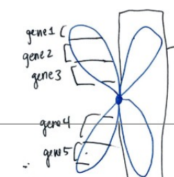
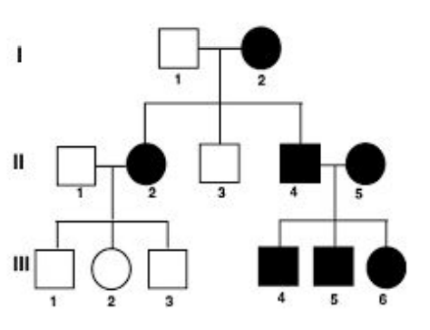

## Genetics

### Initial Definitions

**Genetics**- The study of inheritance & variation of inherited characteristics.
**Heredity**- The passing of physical or mental characteristics genetically onto the next generation.
**Genes**- A unit of heredity which is transferred from parent to child. Genes code for proteins will give expressed traits.
**Traits**- A characteristic. Can by physical or physiological.
### Chromosomes

Humans have 46 chromosomes in each cell (except for sperm, egg & red blood cells). These 46 chromosomes are then made into 23 pairs. The 23rd pair is what determines our gender (XY for male, XX for female.) Since chromosomes are made from our parents (50/50) ( ͡° ͜ʖ ͡°), our moms give us an X (she only has X) and our dads determine our gender by giving either an X or Y. 

Each chromosome contains many genes. Each band is a gene and code that gives us our physical traits. 

#### Alleles

**Alleles**- one of 2+ alternative from of a gene. You have 2 copies of each gene but they won't necessarily be identical (one from ur mom and one from your dad.) Depending on which alleles you have, you will express it dependent on a few things.

Each trait is carried on a gene and can manifest in different forms (Blond hair for example.) These forms are called Alleles (if you can't pronounce that, you're fucking stupid.)

We use uppercase and lowercase to represent different alleles for the same gene. The combination you inherit from your mom and dad will determine how you will look in that aspect.

We represent **dominant alleles** with uppercase letters (D, E, F, etc.) and **recessive alleles** (*submissive* *~o( =∩ω∩= )*) with lowercase letters (d, e, f, etc.) 

**Principle of Dominance** - If a dominant allele is present, that trait is expressed in the individual.
### Pedigrees

**Pedigrees** is a genetic representation of a family tree. Pedigrees show relationships between family members and indicates which individuals carry, silently carry, or lack the trait represented.

Circles - Genetic females
Squares - Genetic males

*Sex is not the same as gender. Another thing to note is that since we don't usually take a karyotype test, we just check whether we have balls or not rather than represent our chromosomal sex*

Shaded in - Exhibits the trait
Horizontal Line - The sex
Vertical line - Descendants
Roman numerals - Either used to separate generations or individuals

