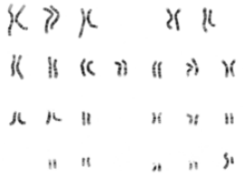

## Genetics

### Initial Definitions

**Genetics**- The study of inheritance & variation of inherited characteristics.
**Heredity**- The passing of physical or mental characteristics genetically onto the next generation.
**Genes**- A unit of heredity which is transferred from parent to child. Genes code for proteins will give expressed traits.
**Traits**- A characteristic. Can by physical or physiological.
### Chromosomes

Humans have 46 chromosomes in each cell (except for sperm, egg & red blood cells). These 46 chromosomes are then made into 23 pairs. The 23rd pair is what determines our gender (XY for male, XX for female.) Since chromosomes are made from our parents (50/50) ( ͡° ͜ʖ ͡°), our moms give us an X (she only has X) and our dads determine our gender by giving either an X or Y. 

Each chromosome contains many genes. Each band is a gene and code that gives us our physical traits. 

#### Alleles

**Alleles**- one of 2+ alternative forms of a gene. You have 2 copies of each gene but they won't necessarily be identical (one from ur mom and one from your dad.) Depending on which alleles you have, you will express it dependent on a few things.

Each trait is carried on a gene and can manifest in different forms (Blond hair for example.) These forms are called Alleles (if you can't pronounce that, you're fucking stupid.)

We use uppercase and lowercase to represent different alleles for the same gene. The combination you inherit from your mom and dad will determine how you will look in that aspect.

We represent **dominant alleles** with uppercase letters (D, E, F, etc.) and **recessive alleles** (*submissive* *~o( =∩ω∩= )*) with lowercase letters (d, e, f, etc.) 

**Principle of Dominance** - If a dominant allele is present, that trait is expressed in the individual.
### Pedigrees

**Pedigrees** is a genetic representation of a family tree. Pedigrees show relationships between family members and indicates which individuals carry, silently carry, or lack the trait represented.

Circles - Genetic females 

Squares - Genetic males

*Sex is not the same as gender. Another thing to note is that since we don't usually take a karyotype test, we just check whether we have balls or not rather than represent our chromosomal sex*

Shaded in - Exhibits the trait

Horizontal Line - The sex

Vertical line - Descendants

Roman numerals - Either used to separate generations or individuals

### Diploid vs Haploid

Diploid means there's 2n chromosomes

Haploid means there's n chromosomes.

Somatic cells are diploid, gametes are haploid.

*Example:
*Humans have 46 chromosomes in their somatic cells whereas they have 23 chromosomes in their gametes.*

### Meiosis

A type of cell division used by gametes to produce half the number of chromosomes. It turns 2n somatic cells into n gametes. It only occurs in the gonads in diploid cells called Germ Line Cells.  Meiosis has 2 divisions: **Meiosis I** & **Meiosis II**.

#### Meiosis I

| Stage | Description | Type of cell produced |
| ---- | ---- | ---- |
| Interphase I | Similar to mitosis interphase & not a part of meiosis. Preparation for cell division.  Chromosomes and centriole pairs replicate, cell grows to accommodate. | 2n |
| Prophase I | Chromosomes condense into visible sister chromatids attached to centromeres. Synapsis occurs in which homologous chromosomes come together to form a tetrad (two chromosomes or four chromatids). Crossing over occurs | 2n |
| Metaphase I | Spindle fibers guide tetrads to the equator. Independent assortment occurs | 2n |
| Anaphase I | Spindle fibers shorten. The tetrads separate and move towards the poles. The sister chromatids are not separated. Only the tetrads. | 2n |
| Telophase I | Doesn't occur in all cells. Homologous chromosomes uncoils and spindle fibers disappear. Cytoplasm divides Nuclear membrane forms 2 cells are formed (without cytokinesis.) | n |
#### Meiosis II

| Stage        | Description                                          | Type of cell produced |
| ------------ | ---------------------------------------------------- | --------------------- |
| Prophase II  | Aligns chromatids with the spindle. Same as mitosis. | n                     |
| Metaphase II | Aligns chromatids at the equator. Same as mitosis.   | n                     |
| Anaphase II  | Separates sister chromatids. Same as mitosis.        | n                     |
| Telophase II             | Nuclei form. Cytokinesis occurs. Four haploid cells produced.                                                     | n                      |
#### Sources of Variation

##### Crossing Over

Homologous pairs carry genes controlling the inherited traits.

Crossing over is when nonsister chromatids at the chiasmata break and reattach to the other chromatid. Occurs in prophase I

##### Independent Assortment

Random orientation of homologous pairs to the poles of the cell. Occurs in metaphase I.

##### Random Fertilization

When a randomly selected gamete from both the male and female are selected and cause fertilization.

#### Mutations & Chromosomal Abnormalities

Mutations are changes in DNA. They can be good or bad. They are caused by errors during mitosis and meiosis as well as environmental factors. Mutations are only inherited if they occur in a gamete.
##### Karyotypes

A photograph of the chromosomes in the nucleus of a somatic cell.

##### Nondisjunction

Leads to issues such as trisomy (when a n+1 gamete fuses with an n gamete leading to a 2n+1 gamete), monosomy (when a n-1 gamete fuses with an n gamete leading to a 2n-1 gamete) and polyploidy (when one has more than two paired sets of chromosomes).

Trisomy:

Monosomy:

Polyploidy:

###### Meiosis I

When both chromosomes of a homologous pair migrate to the same pole and meiosis II would proceed as normal. This leads to two cells with a n+1 chromosome number and two with n-1.

###### Meiosis II

When sister chromatids move to the same pole during Anaphase II. Leads to n+1 and n-1 cells.

##### Deletion

When a portion of a chromosome is lost (usually caused by crossing over).

##### Duplication

When a gene sequence is repeated more than normal within one or more chromosomes. Caused by crossing over. More harmless than the others but there's a tolerance.

##### Inversion

When a gene segment becomes free from the chromosome and is reinserted in the reversed order. Alters gene activity but does not alter an individual phenotypically.

##### Translocation

When a piece of a nonhomologous chromosome breaks off and attaches to another. Does not affect total amount of genetic material but leads to deficiencies and duplications of genetic material after meiosis.

## Evolution

### Mechanisms of Evolution

- Mutation - Goofy changes to DNA, introduces potentially useful traits.
- Natural Selection - A non random mechanism. Individuals who survive and reproduce have traits that are "more fit" and are therefore able to pass on these genes and increase the volume of their traits to the gene pool.
- Non-random mating - When organisms prefer to mate with certain genotypes.
- Genetic drift - A random reduction in allele frequencies due to the bottleneck effect
	Bottleneck effect is when there's a sudden reduction in population which then repopulates but with less genetic variation.

### Natural Selection

**Points of natural selection:**
1. Individuals of a species are not identical (variation)
2. Traits are passed from generation to generation (inheritance)
3. Over time, selection results in changes in a species (time)
4. Only those who survive and are more fit will reproduce. (selection)
### Hardy-Weinberg Principle

States allele frequencies in a population will remain constant over time **if**:
1. Population size remains large
2. Mating opportunities are equal
3. No mutations occur
4. No natural selection occurs (all individuals have an equal chance of reproducing)

### Speciation & Reproductive Isolating Mechanisms

| Speciation Mechanisms | Description | Example |
| ---- | ---- | ---- |
| Allopatric Speciation | When a population of a species becomes geographically isolated from another.  | Ocean, mountain, land, etc separating the two species. |
| Sympatric speciation | Gene flow is reduced between populations. | Fly A only mates on Fruit A and Fly B only mates on Fruit B |

### Reproductive Isolating Mechanisms

#### Prezygotic

Mechanisms before a zygote is formed

| Mechanism | Description | Example |
| ---- | ---- | ---- |
| Ecological Isolation | Two species breed at the same time and general area but not places. | Frog A likes to breed in quiet streams while Frog B breeds in rain pools |
| Behavioral Isolation | No sexual attraction between species due to differing behaviors | Species A makes a *Bzzzzz* mating call while Species B makes a *Nya~* mating call. |
| Mechanical Isolation | When sex organs are not compatible. In the case of plants, when the structure of the plant prevents certain animals from pollinating it. | If a plant flower is too long for a bird beak, it cannot be pollinated by that bird. |
| Gametic Isolation | The two species can breed but the gametes do not form a zygote. | Sea urchins release their sperm and egg into the sea. The egg can only be fertilized by the sperm of the sea urchin. |
| Temporal Isolation | The species mate in the same areas but not at the same time/season/etc. | Species A mates during spring, Species B mates during fall. |

#### Postzygotic

For when love finds a way and two species somehow still manage to form a zygote.

| Mechanism          | Description                                                            | Example                                                                |
| ------------------ | ---------------------------------------------------------------------- | ---------------------------------------------------------------------- |
| Zygote Mortality   | No fertilized zygotes/embryos develop to maturity                      | Sheep and goats can reproduce but the zygotes are not viable.          |
| Hybrid Inviability | The hybrid does not survive and may die shortly before birth/maturity. | Tigers and leopards can mate but it ends with a miscarriage/stillborn. |
| Hybrid Sterility                   | The hybrid reaches maturity but cannot reproduce due to abnormal sex organs.                                                                       | Mules cannot reproduce as they are the result of a male donkey and female horse mating.                                                                       |
### Evidence

**Fossils** in layers closer to the surface (younger layers) are of organisms that are more alike modern species than those in older rock layers. Therefore displaying how species may have evolved over time and providing a direct visual representation of the ancestors of these species.

**DNA** can also prove evolution. Eukaryotic cells have noncoding genes (pseudogenes) that can be thought as evidence as 98% of our genome is nonfunction and thought to be from an ancestor. We can also use the similarity of genes to prove evolution. We share 98% of our DNA with chimps indicating that we share a common ancestor.

**Anatomical features** such as *vestigial* (useless/fragmented features from ancestral species), *homologous* (a trait that has a shared common ancestor/different function due to divergent evolution), *analogous* (structures share similar function but not origin due to convergent evolution) can prove evolution as well.
## Diversity of Life

### Kingdoms

| Kingdom    | Characteristics                                                                                                                                                            | Examples                                                                                                                                                                                                                                                                                                                             |
| ---------- | -------------------------------------------------------------------------------------------------------------------------------------------------------------------------- | ------------------------------------------------------------------------------------------------------------------------------------------------------------------------------------------------------------------------------------------------------------------------------------------------------------------------------------ |
| Eubacteria | - Prokaryotic - Unicellular - Peptidoglycan cell walls - Reproduces asexually (binary fission) and sexually (conjugation) - Can be autotropic or heterotrophic |                                                                                                                                                                                                                                                                                                                                      |
| Archaea    | - Prokaryotic - Nonpathogenic - Protein cell walls - Live in extreme environments                                                                                 |                                                                                                                                                                                                                                                                                                                                      |
| Protista   | - Eukaryotic - Some are single celled, multi celled, or colonial - Some are autotrophic, some are heterotrophic - Can be sessile or mobile                        | **Protozoa** - Flagellates (Have flagellum) - Ciliates (Have cilia) - Sarcodines (Have pseudopods) - Sporozoans (Non-motile)  **Algae** - Green algae (Unicellular) - Brown algae (Multicellular) - Diatoms (Unicellular)  **Slime & Water Moulds** (Produce sports, motile, cellulose cell walls)  |
| Fungi      | - Eukaryotic - Heterotrophic - Chitin cell walls - Multicellular - Reproduction via spores (sexual and asexual) - Made of hyphae                            |                                                                                                                                                                                                                                                                                                                                      |
| Animalia   | - Eukaryotic - Multicellular - Lack cell walls - Heterotrophs - Mobile at one point in their lives - Sexual reproduction                                    | **Poriferans** - Sponges **Cnidarians** - Jellyfish - Adds Radial Symmetry & Simple Nervous System **Platyhelminthes** - Tapeworm - Bilateral Symmetry & Cephalization **Nematodes** - Pinworm - Pseudocoelomate & Complete digestive system **Mollusks** - Squid - Coelomate **Annelids** - Segmented worm **Arthropods** - Crab **Echinoderms** - Starfish - Radial symmetry in adulthood, Bilateral symmetry in embryonic development. **Chordates** - Human - Radial symmetry |
| Plantae    | - Eukaryotic - Multicellular - Autotrophic - Cellulose cell walls - Sessile                                                                                                                                                                           | Ferns Gymnosperms (Cones) Angiosperms (Flowers) Mosses and Liverworts                                                                                                                                                                                                                                                                                                                                     |

**Side thing: Viruses**
- Not alive
- No cellular structure
- Cannot reproduce on their own (need hosts)

### Life Cycles

#### Basidiomycota

#### Bryophyte

#### Gymnosperm 

#### Pteridophyte

#### Angiosperm

### Symbiosis

| Types        | Description |
| ------------ | ----------- |
| Mutualism    | Both organism benefit from the relationship.            |
| Commensalism | One organism benefits and the other is not harmed nor benefited            |
| Predation    | An organism feeds on another            |
| Parasitism   | An organism (parasite) causes harm to the other (host) and uses them as a habitat and for resource aqquisition.            |
| Competition             | Contest between two organisms for resources, habitat, etc.            |

## Systems

### Organs & Systems

#### Digestive System

| Parts             | Description                                                                                                                                                               |
| ----------------- | ------------------------------------------------------------------------------------------------------------------------------------------------------------------------- |
| Mouth             | Used for mechanical digestion (teeth) and chemical digestion (enzymes)                                                                                                    |
| Tongue            | Mixes and pushes bolus to back of throat                                                                                                                                  |
| Salivary Glands   | Produces saliva (Lubrication, swallowing aid, & chemical digestion)                                                                                                       |
| Pharynx           | Guides food from the oral cavity into esophagus. Has the epiglottis which keeps food from entering trachea.                                                               |
| Esophagus         | Carries bolus to stomach using peristalsis (muscle contractions to carry food down using smooth muscle tissue)                                                            |
| Cardiac Sphincter | Contracts and relaxes to keep food from going back into the esophagus.                                                                                                    |
| Stomach           | Capacity 1500mL of storage. Breaks down proteins (HCl and enzymes) and liquifies food into chyme.                                                                         |
| Pyloric Sphincter | Chyme leaves the stomach via the pyloric sphincter.                                                                                                                       |
| Small intestine   | Divided into 3 parts: duodenum, jejunum, Ileum. Highly folded (for max surface area) and lined with microvilli. Breaks down and absorbs nutrients via chemical digestion. |
| Large intestine   | Absorbs water and minerals from undigested food.                                                                                                                          |
| Anus              | Controls the release of feces.                                                                                                                                            |
| Liver             | Produces bile, stores carbs and vitamins, detoxes substances in blood.                                                                                                    |
| Gallbladder       | Stores bile and releases into duodenum.                                                                                                                                   |
| Pancreas                  | Produces sodium bicarbonate which raises pH of chyme in duodenum. Secretes enzymes for digestion.                                                                                                                                                                          |
##### Chemical Digestion

| Macromolecule | Subunit Produced        |
| ------------- | ----------------------- |
| Carbohydrates | Simple sugars (glucose) |
| Proteins      | Amino Acids             |
| Lipds              | Fatty Acids                        |

| Enzyme             | Macromolecule           | Produced                       | Acts in:                   |
| ------------------ | ----------------------- | ------------------------------ | -------------------------- |
| Salivary Amylase   | Carbohydrates           | Salivary Glands                | Mouth                      |
| Pancreatic Amylase | Carbohydrates           | Pancreas                       | Small intestine (duodenum) |
| Lactase            | Carbohydrates (Lactose) | Small Intestine                | Small intestine (duodenum) |
| Lipase             | Lipids/Fat              | Stomach                        | Small intestine (duodenum) |
| Pancreatic Lipase  | Lipids/Fat              | Pancreas                       | Small intestine (duodenum) |
| Bile               | Lipids/Fat              | Liver (stored in gall bladder) | Small intestine (duodenum) |
| Pepsin             | Protein                        | Stomach                               | Stomach                           |
| Trypsin                   | Protein                        | Pancreas                               | Small Intestine (duodenum)                           |
#### Respiratory System

| Parts             | Description                                                                                                                                                     |
| ----------------- | --------------------------------------------------------------------------------------------------------------------------------------------------------------- |
| Nasal Cavity      | Warms, filters, and cleans air                                                                                                                                  |
| Pharynx           | Contains the epiglottis which prevents food from entering trachea                                                                                               |
| Larynx            | Contains your vocal chords                                                                                                                                      |
| Trachea           | Extends from larynx to bronchi. Lined with goblet cells to trap debris from air that escaped nasal cavity. Reinforced with cartilage rings to prevent collapse. |
| Bronchi           | Carries air in and out of lungs.  Reinforced with cartilage rings to prevent collapse.                                                                          |
| Alveoli           | Carry out gas exchange and diffusion.                                                                                                                           |
| Diaphragm         | Contracts to give room for lungs to expand when breathing in. Relaxes when lungs deflate when breathing out.                                                    |
| Pleural membranes | Holds 2 lungs within pleural cavity.                                                                                                                            |
| Intercoastal muscles                  | Moves ribs up and out to give room for lungs to inflate.  Moves ribs back in when breathing out.                                                                                                                                                                |
#### Circulatory System

| Parts   | Description                                |
| ------- | ------------------------------------------ |
| Blood   | Transports material through the body       |
| Vessels | Network of tubes in which blood circulates |
| Heart        | Pump which pushes blood through vessels                                           |

| Circuit   | Description                                            |
| --------- | ------------------------------------------------------ |
| Pulmonary | Circulates blood from heart to lungs for gas exchange. |
| Systemic          | Circulates oxygenated blood from heart to body then sends deoxygenated blood from body to heart.                                                       |

| Part | Description |
| ---- | ---- |
| Superior/Inferior vena cava | Receives deoxygenated blood from rest of body. |
| Atria | Receive blood from body (right) or lungs (left) |
| Ventricles | Pump blood |
| AV (atrioventricular) valves | Separates Atria and Ventricles. Prevents blood from flowing back into the atria. |
| Septum | Separates two sides of heart. Prevents backflow into ventricles |
| Semilunar valves | Separates ventricles from arteries |

| Vessel | Description                                                                                    |
| ------ | ---------------------------------------------------------------------------------------------- |
| Vein   | Carries deoxygenated blood back to heart (except for pulmonary which carries oxygenated)       |
| Artery | Carries oxygenated blood away from the heart (except for pulmonary which carries deoxygenated) |
| Capillaries       | Diffuses O2 and CO2 with cell.                                                                                               |
### Relationships Between Systems

**Digestion system** provides nutrients which are carried by blood from **circulatory system** and then used (in the case of glucose) in cellular respiration in the **respiratory system**. **The circulatory system** then transports the oxygenated blood produced to the **digestive system** to deliver oxygen.

### Diseases and Disorders

Asthma: Inflammation causes airways to narrow and excess mucus to be excreted making it harder to breathe and receive oxygen.

Atherosclerosis: A plaque build up in the arteries within the circulatory system. This narrows the arteries making it harder for blood (and therefore oxygen) to flow. This can lead to heart attacks.

IBS (Irritable Bowel Syndrome) is a common digestive disorder. Some symptoms of IBS include abdominal pain, bloating and painful bowel movements. These complications are a result of irregular contractions of the intestines which affect the movement of food and waste through the digestive system