## Isotopes

**Isotopes** are atoms of the same element that have different masses due to having a different number of neutrons.

*Example: 
Carbon-12: 6 Protons, 6 Neutrons
Carbon-14 6 Protons, 8 Neutrons*

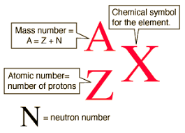

Isotopes have the same atomic number (Z) because they have the same amount of protons but different mass numbers (A) because they don't have the same amount of neutrons.

Isotopes have similar chemical properties because they still have the same amount of protons. They **don't** have the same physical properties because they have a different atomic mass.

### Atomic Mass

**Atomic Mass** is the weighted average mass of all naturally occurring isotopes of a specified element. Not to be confused with mass number.

#### Atomic Mass Unit (AMU)

**Atomic Mass Unit** or *AMU* is a unit used to compare the masses of atoms and uses the symbol `μ`. It's approximately equal to the mass of a single proton or neutron.
#### Calculating Atomic Mass

Elements can have many different isotopes so how do we get an average mass or atomic mass? We simply weigh the mass of every type of isotope and use a weighted average.

To calculate this, you need to know what the different isotopes' masses and abundances are.

We use a **mass spectrometer** which deflect atoms via magnetic fields inside the machine. 

Ions are deflected based on 2 things:
1) Lighter ions will deflect more whilst heavier ions will drop off quicker.
2) Ions with higher charges will be deflected more.

These 2 factors can be combined into the mass/charge ratio (m/z).

*Example:
Ion has a mass of 28 & +1 charge
28/1 = 28
Therefore, the mass/charge ratio is 28*

*Ion has a mass of 56 & +2 charge
56/2 = 28
Therefore, the mass/charge ratio is 28*

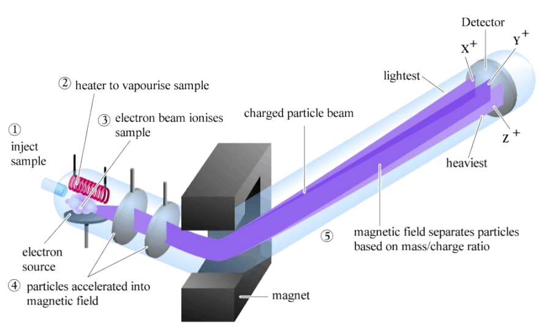

##### Equations

The base equation you'll probably need to remember is: 
```
atomic_mass = (isotope_mass_1*abundance_1) + (isotope_mass_2*abundance_2)...
```

You'll probably notice you the more isotopes you have, the more you'll just need to extend the equation.

This equation will essentially let you find atomic mass, abundance, and isotope masses given you know how to plug in numbers and basic algebra. If you don't, *why are you even here?*

**Note:** Make sure abundance is in decimal form (0.5). Not percentage (50%).
###### Finding Average Atomic Mass
*Example:
This requires you to know/have all isotopes' masses and relative abundance
Zirconium has 5 isotopes
Zr-90 has a mass of 90 amu & has an abundance of 51.5%
Zr-91 has a mass of 91 amu & has an abundance of 11.2%
Zr-92 has a mass of 92 amu & has an abundance of 17.1%
Zr-94 has a mass of 94 amu & has an abundance of 17.4%
Zr-96 has a mass of 96 amu & has an abundance of 2.8%*

*The equation would probably look like this:*

```
(90*0.515)+(91*0.112)+(92*0.171)+(94*0.174)+(96*0.028) = 91.3
```

*Answer has been rounded and accounting for uncertainty, if you look at your periodic table, it will be the same mass.*

###### Finding mass of a isotope

*Example:
This requires you know the other isotopes' masses and abundances as well as the atomic mass of the element
Bromine has 2 isotopes
Br-79 has a mass of 78.917 amu & an abundance of 50.69%
Br-81 has a mass of ? & has an abundance of 49.31%
Bromine's atomic mass is 79.90
We will be finding out the mass of Br-81*

*The equation will look like this:*
```
79.90 = (78.917 * 0.5069) + 0.4931m
```

*Simplify*
```
79.90 = 40.0030273 + 0.4931m
```

*Rearrange*
```
79.90 - 40.0030273 = 0.4931m
```

*Solve*
```
m = 80.91 amu
```

*Therefore, Br-81's mass is 80.91 amu*
###### Finding Relative Abundances

*Example:
This requires you know all isotope masses and element atomic mass
Ga-69 has a mass of 68.926
Ga-71 has a mass of 70.925
Gallium has an atomic mass of 69.72
Instead of having 2 unknown variables, let's try to have 1.*
```
69.72 = 68.926x + 70.925(1-x)
```
*Because relative abundance is a percentage, it's out of 100 or 1 if in decimal. Therefore, if we have 2 isotopes, we can simply have one variable and the other unknown be 1-x*

*Distribute*
```
69.72 = 68.926x + 70.925 - 70.925x
```

*Rearrange & Simplify*
```
-1.20500 = -1.99900x
```

*Solve*
```
x = 0.603 = 60.3%
```

*Now we can solve for the other by subtracting x from 1*
```
1 - 0.603 = 39.7%
```

*We now know the relative abundances and can present an answer:*
```
Ga-69: 60.3%
Ga-71: 39.7%
```

### Quick History Lesson - Marie Curie

Marie and Pierre Curie discovered and isolated radium and polonium in the early 1900's. We all now know those elements give off radiation. As radiation was released, atoms of the element were turned into atoms of different elements (this keeps up until non-radioactive elements are formed.) Marie Curie died due to aplastic pernicious anaemia caused by her research.

*Example:
Polonium Alpha Decay
Po-218 -> Pb-214 + He-4*

### Radioisotopes & Nuclear Decay

Not all elements are stable. Radioisotopes decay and emit radiation (those being alpha and beta particles and gamma rays) due to nuclear changes. This obviously makes them radioactive.

#### What Makes An Atom Unstable?

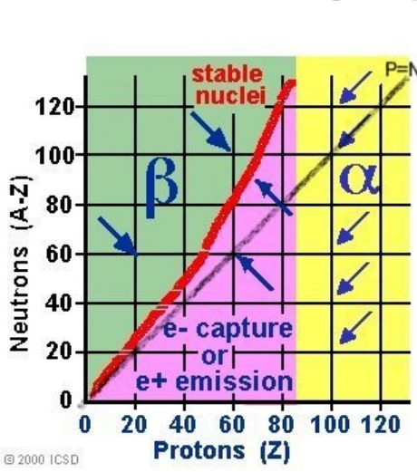

If ratio of neutrons and protons falls on the red line, an atom is considered stable. If not, depending on the ratio, it may either perform beta or alpha decay. 
#### Half-life

Half-life is a unique characteristic of radioisotopes. It's the time it takes for one half the nuclei in a radioactive sample to decay. 

1 half life is half of a sample, 2 half lives are a quarter of a sample and so on and so forth. 

The equation to calculate the remaining sample after half lives is:
```
(1/2)^half_lives * initial_sample_size
```


*Example
Carbon-14's half life is 5730 years (a.)*

#### Types of Decay

*Alpha decay* - Low energy radiation which can simply be stopped by paper or cloth. An unstable isotope ejects an alpha particle from its nucleus.

*Beta decay* - Radiation which releases an election and can be stopped by aluminum foil or skin. Neutron is converted into a proton and electron.

*Gamma decay* - Radiation which can mutate DNA and is just energy. It can penetrate skin and cells. (Very bad stuff)

## Bohr Rutherford

### Neils Bohr
- Born in Copenhagen, Denmark
- Worked with Ernst Rutherford in England
- Nobel Laureate in 1922
- Served as a consultant at Los Alamos for the atomic bomb project
- Organized a conference of Scientists and Politicians to control the spread of nuclear weapons internationally

### Intro to Bohr's Ideas

Rutherford theorized electrons orbit the nucleus. However, the laws of physics state that electrons should give off energy, slow down, and collapse into the nucleus. Therefore, Rutherford's model needed to be modified, Bohr used light and spectra to analyze atomic structure. Bohr chose to experiment with hydrogen because it's the simplest atom, has one electron in it's structure & has one simple line spectrum.

### Bohr's Experimentation

Bohr passed an electric current through H<sup>2</sup> to force electrons into a higher energy state. A line spectrum is produced as atoms emit a characteristic set of discrete wave lengths.

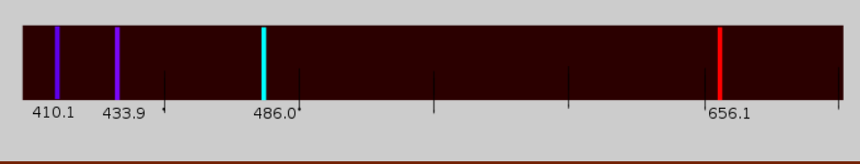

The lines suggest electrons travel at different orbits of fixed energy. In simpler terms, electrons orbit at a constant distance from the nucleus and don't move unless forced to. 

### Electron Quantization

If an electron is quantized, it means that the electron has a specific amount of energy.

If an electron was like a ball on a staircase, the ball could only be found on a step and never between steps. This is just like an electron which can only be found at specific energy levels and never in between. 

Another analogy is the turtle. A turtle sitting on a staircase can only take on certain discrete energies. Energy is required to move the turtle up (absorption) and some energy is released to move down (emission). 

### Why are there multiple lines in the line spectrum for Hydrogen?

An atom at ground state has its electrons at the lowest energy levels. However, when charged with energy (electricity/heat), electrons jump to higher energy levels. They will eventually fall back down and release energy as they drop. The energy released is equal to energy absorbed which is emitted as the colors we see with a spectroscope. The colors represent the amount of energy released.

### Pros & Cons of the Bohr Model

#### Pros:
- Explains why atoms are stable and electrons don't crash into the nucleus
- Explains the line spectrum of elements as energized elements give off light with specific wavelengths as electrons transition between energy levels

#### Cons:
- Does not work well for explaining atoms of elements aside from H
- The motion and position of an electron can not be predicted at a point in time
- Orbits are not at fixed radiuses

## Quantum Theory & Orbitals

Here's the thing about electrons: contrary to popular belief, for the most part, we don't know where the fuck electrons actually are. We know where they are generally (shells, orbitals, etc) but we can't pinpoint them at a fixed point in time (Heisenberg's Uncertainty Principle.)

Knowing how electrons are arranged is important because it defines how atoms will interact with each other.

**Orbitals** are areas within atoms where there is a roughly a 90% chance of finding electrons. Orbitals are defined mathematically but can be visualized in a 3D space. 

### Energy Levels

Bohr's energy levels are based on the principle quantum number (n). Elements in period 1 (H, He) have a PQN of 1 (n=1). Elements in period 2 (Li, Be, etc) have a PQN of 2 (n=2). This keeps going

#### Sublevels

Within energy levels are sublevels (aka orbitals.) In n=1, there is only 1 sublevel called the 1s orbital.

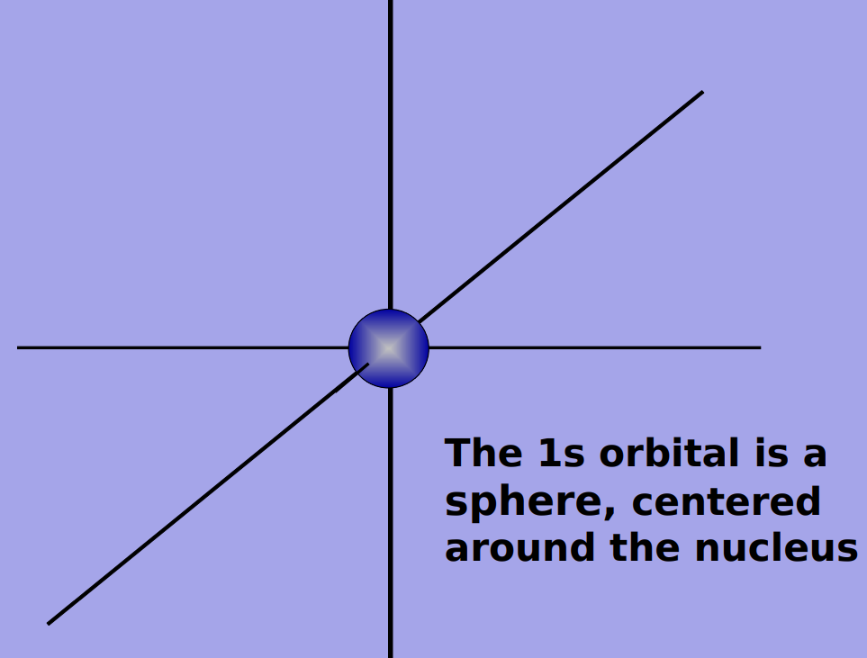

In n=2, there are 2 types of orbitals:
- 1 *s orbital*
- 3 *p orbitals*

P orbitals are found in every energy level except for n=1.

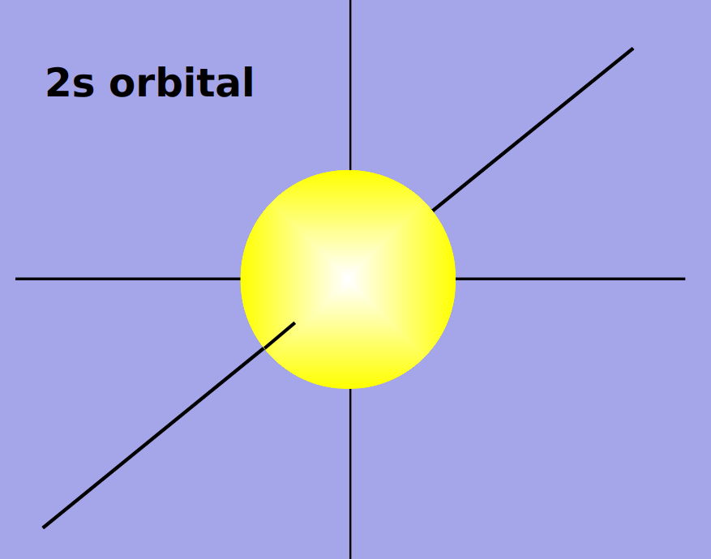

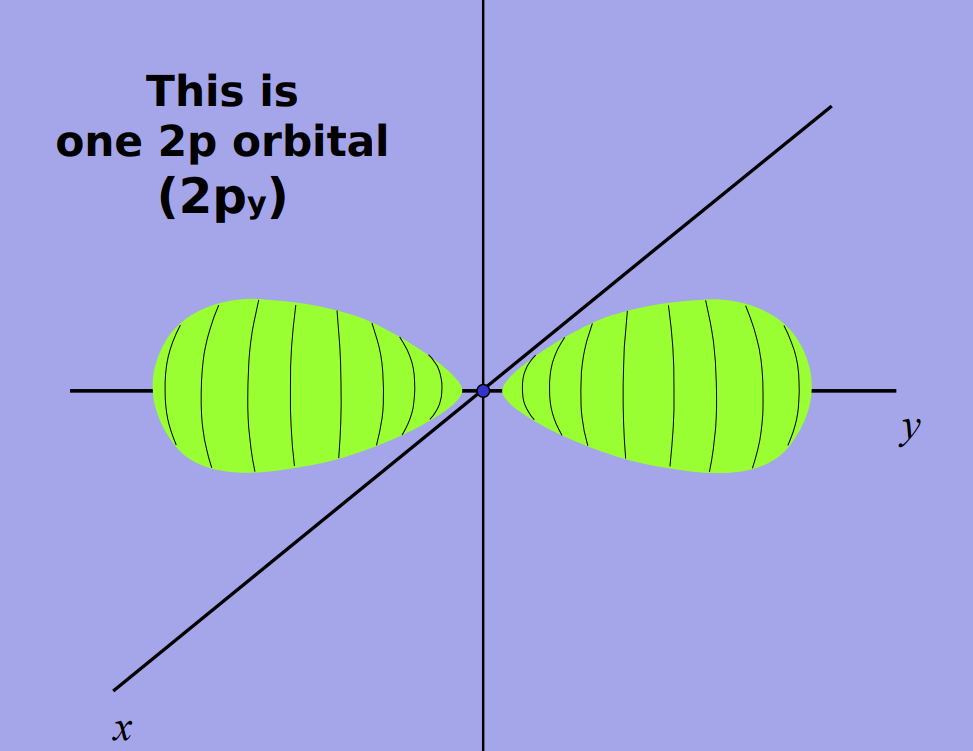
\**Keep in mind there are 3 of these on the x, y, & z axis overlaid on the 2s orbital.*

Along with s & p orbitals, you also have d & f orbitals. 

D orbitals start from n=3. There are 5 types of d orbitals.


F orbitals are even more irregular. There are 7 types and don't occur until n=4. They are also found in the Lanthanide & Actinide series.

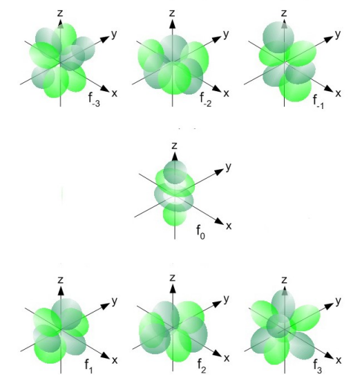
##### Orbital Capacities

All orbitals can only hold 2 electrons. However, orbitals have different quantities for energy levels. 

For example, you can only have 1 s orbital per energy level while you can have 3 p orbitals per energy level.

This means that for each orbital set, you'll technically have different capacities.

| Orbital    | Amount                                 | Amount of Electrons/Math/Explanation |
| ---------- | -------------------------------------- | ------------------------------------ |
| \<Orbital> | \<Amount Of Orbitals Per Energy Level> | Amount of orbitals \* 2              |
| S          | 1                                      | 1 \* 2 = 2                           |
| P          | 3                                      | 3 \* 2 = 6                           |
| D          | 5                                      | 5 \* 2 = 10                          |
| F          | 7                                      | 7 \* 2 = 14                                     |

You may think you see a pattern for the next orbital. **THERE IS NO PATTERN**
### Electron Orbital Configuration

Something you may be thinking is "How do you apply this to atoms?" or "How can I write this out for an atom?" or "What the actual fuck? This shit makes no sense, I give up.". All of these are valid questions (except for the last one which 50% a statement.) 

We can relate all these orbitals to atoms while also representing atoms with electron orbital configuration.

Let's start with something simple, everyone's favorite element: Hydrogen \\(￣︶￣*\\)).

We need to first determine how many electrons are in a Hydrogen atom. If you've taken any chemistry class in the last few years (and don't have early onset dementia,) you would know that the amount of protons are equal to the amount of electrons and that the number of protons is conveniently also the atomic number. In this case, it's 1.

Since we have 1 electron and we know Hydrogen is in energy level 1, we know we only have the 1s orbital.

The 1s orbital can hold 2 electrons but for now, it only needs to hold 1.

We would write it as so:

1S<sup>1</sup>

Let's breakdown what this means:

| 1            | S                | 1                                      |
| ------------ | ---------------- | -------------------------------------- |
| Energy Level | Sublevel/Orbital | Amount of electrons in said orbital(s) |

Let's try Helium (He). Helium has 2 electrons. S1 can hold 2. We also know that Helium is n=1.

Therefore, we write it as this:

1S<sup>2</sup>

"What about when 1S or other orbitals are filled?" Then just move on to the next orbital. You'll need to memorize the order.

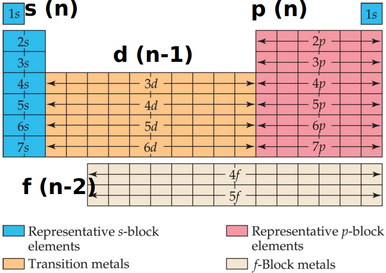

It gets weird after 3p as 3d actually goes after 4s and not 3s. It continues like that for the rest of the periodic table so keep that in mind.

Here's the exact order.
1s<sup>2</sup> 2s<sup>2</sup> 2p<sup>6</sup> 3p<sup>6</sup> 3s<sup>2</sup> 4s<sup>2</sup> 4p<sup>6</sup>5s<sup>2</sup> 3d<sup>10</sup> 5p<sup>6</sup> 6s<sup>2</sup> 4d<sup>10</sup> 6p<sup>6</sup> 7s<sup>2</sup> 5d<sup>10</sup> 4f<sup>14</sup> 7p<sup>6</sup>

Let's try something a bit harder.

Sodium has 11 electrons. 

1s can hold 2 electrons. 2s holds another 2, 2p holds 6 electrons in total, and 3s only needs to hold the remaining 1.

2 + 2 + 6 + 1 = 11

Therefore, we can write sodium as 1s<sup>2</sup>2s<sup>2</sup>2p<sup>6</sup>3s<sup>1</sup>

#### Pro-Tips

##### Simplify Electron Configs Using Noble Gases

Because Noble Gases have complete orbitals, we can use them to simplify long electron configurations. An example is Bromine (Br). If we were to write out the full notation, it would look like this: 1s<sup>2</sup>2s<sup>2</sup>2p<sup>6</sup>3s<sup>2</sup>3p<sup>6</sup>4s<sup>2</sup>3d<sup>10</sup>4p<sup>5</sup>. With Noble Gases, we can shorten it to this: \[Ar]4s<sup>2</sup>3d<sup>10</sup>4p<sup>5</sup>. Remember to only use the closest Noble Gas before the atom in question and only do this with Noble Gases.

##### Find PT Position With Electron Configs

The last orbital is the position of the atom in the periodic table. Eg. Lithium's last orbital is 2s<sup>1</sup> meaning it's in the second period and first column.
### Orbital Diagrams

Example:
![[Lithium_Orbital_Diagram.png]]

Each box represents 1 orbital and the arrows are electrons. The direction of the arrows represent the relative spin of the electron.

#### Distribution Rules

##### Pauli Exclusion Principle

No 2 electrons in the same atom can have the exact same energy. They can't have the same 4 quantum numbers or the same spin.

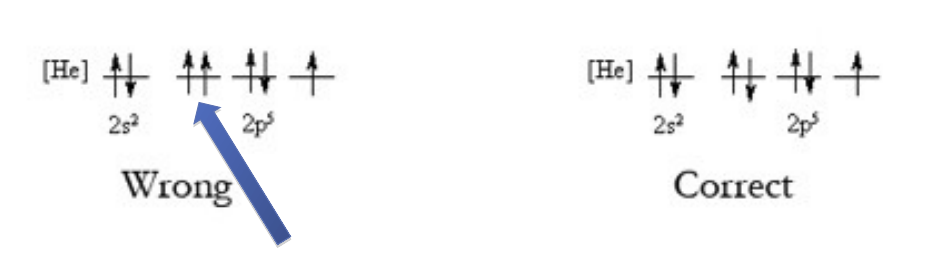

##### Aufbau Principle
Always built the electron structure starting at the lowest energy level. (s<p<d<f)

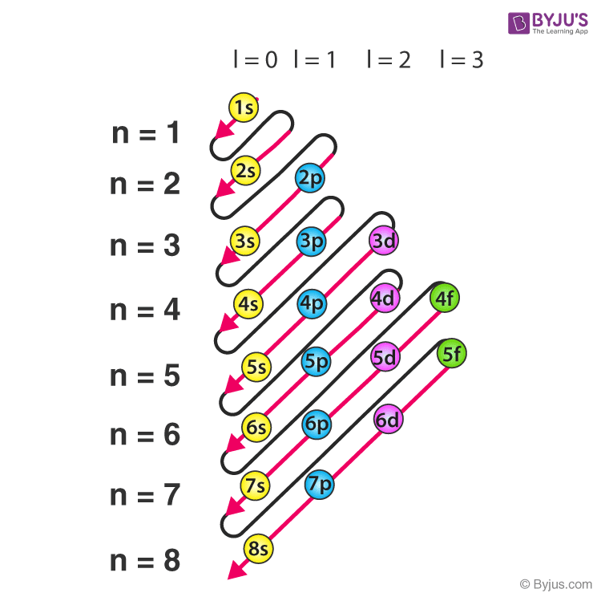

##### Hund's Rule

Electrons will arrange themselves in the same orbital with the max number of unpaired electrons. In more dumb dumb terms, spread electrons as much as possible before adding more to an orbital that already has an electron.

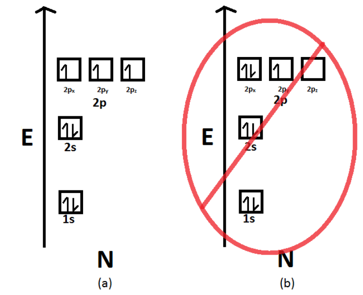