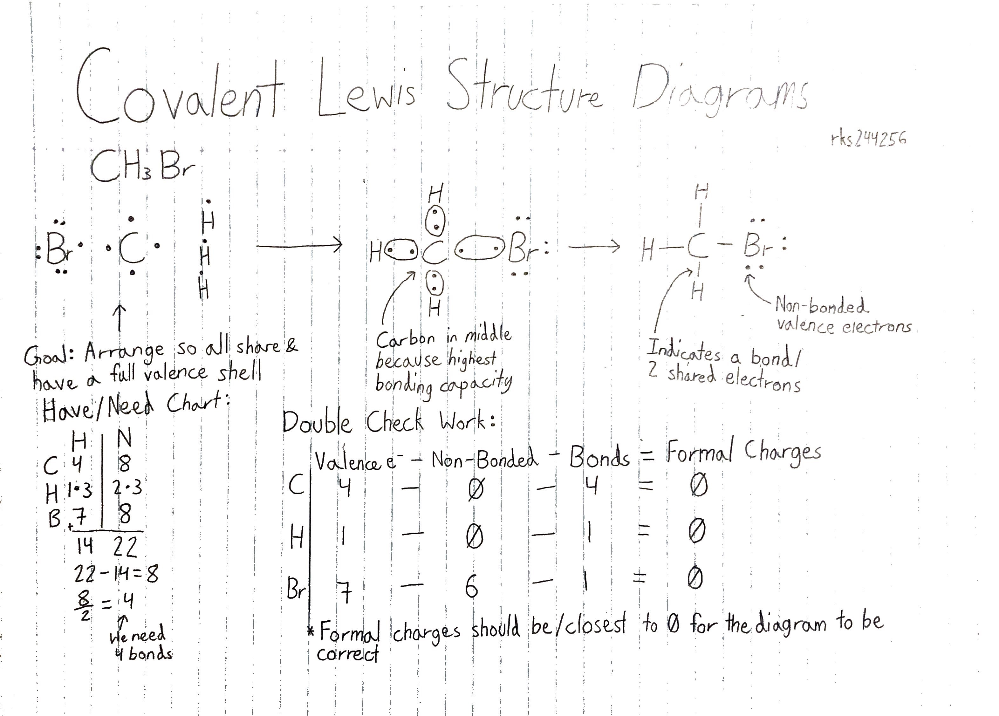
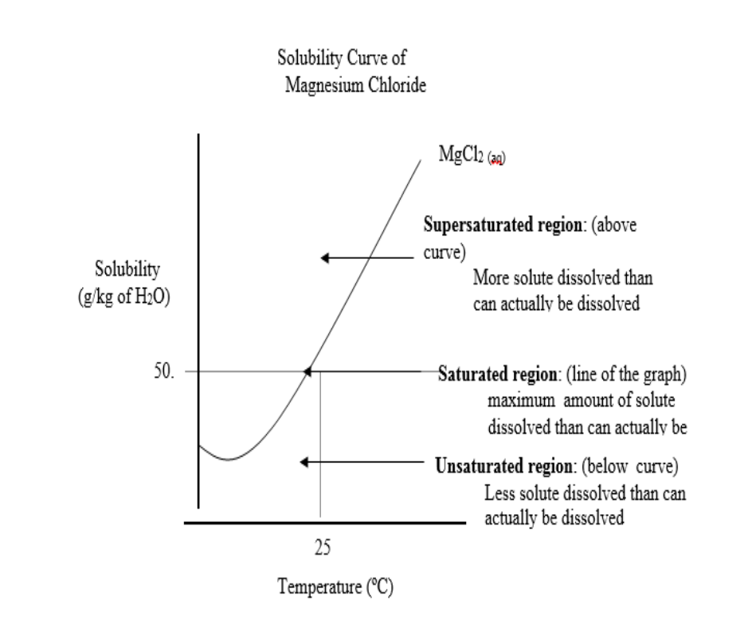
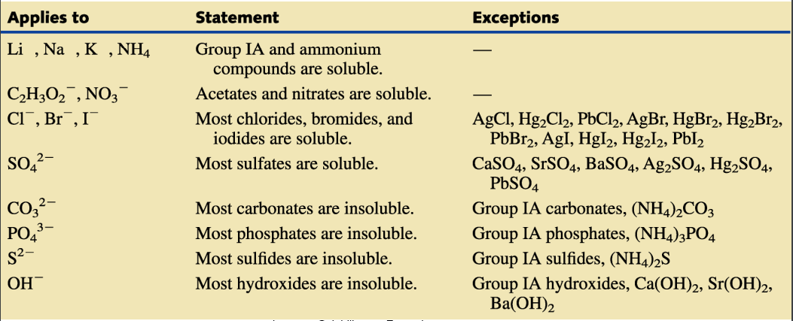

 ## Isotopes

**Isotopes** are atoms of the same element that have different masses due to having a different number of neutrons.

*Example: 
Carbon-12: 6 Protons, 6 Neutrons
Carbon-14 6 Protons, 8 Neutrons*


Isotopes have the same atomic number (Z) because they have the same amount of protons but different mass numbers (A) because they don't have the same amount of neutrons.

Isotopes have similar chemical properties because they still have the same amount of protons. They **don't** have the same physical properties because they have a different atomic mass.

### Atomic Mass

**Atomic Mass** is the weighted average mass of all naturally occurring isotopes of a specified element. Not to be confused with mass number.

#### Atomic Mass Unit (AMU)

**Atomic Mass Unit** or *AMU* is a unit used to compare the masses of atoms and uses the symbol `μ`. It's approximately equal to the mass of a single proton or neutron.
#### Calculating Atomic Mass

Elements can have many different isotopes so how do we get an average mass or atomic mass? We simply weigh the mass of every type of isotope and use a weighted average.

To calculate this, you need to know what the different isotopes' masses and abundances are.

We use a **mass spectrometer** which deflect atoms via magnetic fields inside the machine. 

Ions are deflected based on 2 things:
1) Lighter ions will deflect more whilst heavier ions will drop off quicker.
2) Ions with higher charges will be deflected more.

These 2 factors can be combined into the mass/charge ratio (m/z).

*Example:
Ion has a mass of 28 & +1 charge
28/1 = 28
Therefore, the mass/charge ratio is 28*

*Ion has a mass of 56 & +2 charge
56/2 = 28
Therefore, the mass/charge ratio is 28*


##### Equations

The base equation you'll probably need to remember is: 
```
atomic_mass = (isotope_mass_1*abundance_1) + (isotope_mass_2*abundance_2)...
```

You'll probably notice you the more isotopes you have, the more you'll just need to extend the equation.

This equation will essentially let you find atomic mass, abundance, and isotope masses given you know how to plug in numbers and basic algebra. If you don't, *why are you even here?*

**Note:** Make sure abundance is in decimal form (0.5). Not percentage (50%).
###### Finding Average Atomic Mass
*Example:
This requires you to know/have all isotopes' masses and relative abundance
Zirconium has 5 isotopes
Zr-90 has a mass of 90 amu & has an abundance of 51.5%
Zr-91 has a mass of 91 amu & has an abundance of 11.2%
Zr-92 has a mass of 92 amu & has an abundance of 17.1%
Zr-94 has a mass of 94 amu & has an abundance of 17.4%
Zr-96 has a mass of 96 amu & has an abundance of 2.8%*

*The equation would probably look like this:*

```
(90*0.515)+(91*0.112)+(92*0.171)+(94*0.174)+(96*0.028) = 91.3
```

*Answer has been rounded and accounting for uncertainty, if you look at your periodic table, it will be the same mass.*

###### Finding mass of a isotope

*Example:
This requires you know the other isotopes' masses and abundances as well as the atomic mass of the element
Bromine has 2 isotopes
Br-79 has a mass of 78.917 amu & an abundance of 50.69%
Br-81 has a mass of ? & has an abundance of 49.31%
Bromine's atomic mass is 79.90
We will be finding out the mass of Br-81*

*The equation will look like this:*
```
79.90 = (78.917 * 0.5069) + 0.4931m
```

*Simplify*
```
79.90 = 40.0030273 + 0.4931m
```

*Rearrange*
```
79.90 - 40.0030273 = 0.4931m
```

*Solve*
```
m = 80.91 amu
```

*Therefore, Br-81's mass is 80.91 amu*
###### Finding Relative Abundances

*Example:
This requires you know all isotope masses and element atomic mass
Ga-69 has a mass of 68.926
Ga-71 has a mass of 70.925
Gallium has an atomic mass of 69.72
Instead of having 2 unknown variables, let's try to have 1.*
```
69.72 = 68.926x + 70.925(1-x)
```
*Because relative abundance is a percentage, it's out of 100 or 1 if in decimal. Therefore, if we have 2 isotopes, we can simply have one variable and the other unknown be 1-x*

*Distribute*
```
69.72 = 68.926x + 70.925 - 70.925x
```

*Rearrange & Simplify*
```
-1.20500 = -1.99900x
```

*Solve*
```
x = 0.603 = 60.3%
```

*Now we can solve for the other by subtracting x from 1*
```
1 - 0.603 = 39.7%
```

*We now know the relative abundances and can present an answer:*
```
Ga-69: 60.3%
Ga-71: 39.7%
```

### Quick History Lesson - Marie Curie

Marie and Pierre Curie discovered and isolated radium and polonium in the early 1900's. We all now know those elements give off radiation. As radiation was released, atoms of the element were turned into atoms of different elements (this keeps up until non-radioactive elements are formed.) Marie Curie died due to aplastic pernicious anaemia caused by her research.

*Example:
Polonium Alpha Decay
Po-218 -> Pb-214 + He-4*

### Radioisotopes & Nuclear Decay

Not all elements are stable. Radioisotopes decay and emit radiation (those being alpha and beta particles and gamma rays) due to nuclear changes. This obviously makes them radioactive.

#### What Makes An Atom Unstable?


If ratio of neutrons and protons falls on the red line, an atom is considered stable. If not, depending on the ratio, it may either perform beta or alpha decay. 
#### Half-life

Half-life is a unique characteristic of radioisotopes. It's the time it takes for one half the nuclei in a radioactive sample to decay. 

1 half life is half of a sample, 2 half lives are a quarter of a sample and so on and so forth. 

The equation to calculate the remaining sample after half lives is:
```
(1/2)^half_lives * initial_sample_size
```


*Example
Carbon-14's half life is 5730 years (a.)*

#### Types of Decay

*Alpha decay* - Low energy radiation which can simply be stopped by paper or cloth. An unstable isotope ejects an alpha particle from its nucleus.

*Beta decay* - Radiation which releases an election and can be stopped by aluminum foil or skin. Neutron is converted into a proton and electron.

*Gamma decay* - Radiation which can mutate DNA and is just energy. It can penetrate skin and cells. (Very bad stuff)

## Bohr Rutherford

### Neils Bohr
- Born in Copenhagen, Denmark
- Worked with Ernst Rutherford in England
- Nobel Laureate in 1922
- Served as a consultant at Los Alamos for the atomic bomb project
- Organized a conference of Scientists and Politicians to control the spread of nuclear weapons internationally

### Intro to Bohr's Ideas

Rutherford theorized electrons orbit the nucleus. However, the laws of physics state that electrons should give off energy, slow down, and collapse into the nucleus. Therefore, Rutherford's model needed to be modified, Bohr used light and spectra to analyze atomic structure. Bohr chose to experiment with hydrogen because it's the simplest atom, has one electron in it's structure & has one simple line spectrum.

### Bohr's Experimentation

Bohr passed an electric current through H<sup>2</sup> to force electrons into a higher energy state. A line spectrum is produced as atoms emit a characteristic set of discrete wave lengths.


The lines suggest electrons travel at different orbits of fixed energy. In simpler terms, electrons orbit at a constant distance from the nucleus and don't move unless forced to. 

### Electron Quantization

If an electron is quantized, it means that the electron has a specific amount of energy.

If an electron was like a ball on a staircase, the ball could only be found on a step and never between steps. This is just like an electron which can only be found at specific energy levels and never in between. 

Another analogy is the turtle. A turtle sitting on a staircase can only take on certain discrete energies. Energy is required to move the turtle up (absorption) and some energy is released to move down (emission). 

### Why are there multiple lines in the line spectrum for Hydrogen?

An atom at ground state has its electrons at the lowest energy levels. However, when charged with energy (electricity/heat), electrons jump to higher energy levels. They will eventually fall back down and release energy as they drop. The energy released is equal to energy absorbed which is emitted as the colors we see with a spectroscope. The colors represent the amount of energy released.

### Pros & Cons of the Bohr Model

#### Pros:
- Explains why atoms are stable and electrons don't crash into the nucleus
- Explains the line spectrum of elements as energized elements give off light with specific wavelengths as electrons transition between energy levels

#### Cons:
- Does not work well for explaining atoms of elements aside from H
- The motion and position of an electron can not be predicted at a point in time
- Orbits are not at fixed radiuses

## Quantum Theory & Orbitals

Here's the thing about electrons: contrary to popular belief, for the most part, we don't know where the fuck electrons actually are. We know where they are generally (shells, orbitals, etc) but we can't pinpoint them at a fixed point in time (Heisenberg's Uncertainty Principle.)

Knowing how electrons are arranged is important because it defines how atoms will interact with each other.

**Orbitals** are areas within atoms where there is a roughly a 90% chance of finding electrons. Orbitals are defined mathematically but can be visualized in a 3D space. 

### Energy Levels

Bohr's energy levels are based on the principle quantum number (n). Elements in period 1 (H, He) have a PQN of 1 (n=1). Elements in period 2 (Li, Be, etc) have a PQN of 2 (n=2). This keeps going

#### Sublevels

Within energy levels are sublevels (aka orbitals.) In n=1, there is only 1 sublevel called the 1s orbital.


In n=2, there are 2 types of orbitals:
- 1 *s orbital*
- 3 *p orbitals*

P orbitals are found in every energy level except for n=1.


\**Keep in mind there are 3 of these on the x, y, & z axis overlaid on the 2s orbital.*

Along with s & p orbitals, you also have d & f orbitals. 

D orbitals start from n=3. There are 5 types of d orbitals.


F orbitals are even more irregular. There are 7 types and don't occur until n=4. They are also found in the Lanthanide & Actinide series.


##### Orbital Capacities

All orbitals can only hold 2 electrons. However, orbitals have different quantities for energy levels. 

For example, you can only have 1 s orbital per energy level while you can have 3 p orbitals per energy level.

This means that for each orbital set, you'll technically have different capacities.

| Orbital    | Amount                                 | Amount of Electrons/Math/Explanation |
| ---------- | -------------------------------------- | ------------------------------------ |
| \<Orbital> | \<Amount Of Orbitals Per Energy Level> | Amount of orbitals \* 2              |
| S          | 1                                      | 1 \* 2 = 2                           |
| P          | 3                                      | 3 \* 2 = 6                           |
| D          | 5                                      | 5 \* 2 = 10                          |
| F          | 7                                      | 7 \* 2 = 14                                     |

You may think you see a pattern for the next orbital. **THERE IS NO PATTERN**
### Electron Orbital Configuration

Something you may be thinking is "How do you apply this to atoms?" or "How can I write this out for an atom?" or "What the actual fuck? This shit makes no sense, I give up.". All of these are valid questions (except for the last one which 50% a statement.) 

We can relate all these orbitals to atoms while also representing atoms with electron orbital configuration.

Let's start with something simple, everyone's favorite element: Hydrogen \\(￣︶￣*\\)).

We need to first determine how many electrons are in a Hydrogen atom. If you've taken any chemistry class in the last few years (and don't have early onset dementia,) you would know that the amount of protons are equal to the amount of electrons and that the number of protons is conveniently also the atomic number. In this case, it's 1.

Since we have 1 electron and we know Hydrogen is in energy level 1, we know we only have the 1s orbital.

The 1s orbital can hold 2 electrons but for now, it only needs to hold 1.

We would write it as so:

1S<sup>1</sup>

Let's breakdown what this means:

| 1            | S                | 1                                      |
| ------------ | ---------------- | -------------------------------------- |
| Energy Level | Sublevel/Orbital | Amount of electrons in said orbital(s) |

Let's try Helium (He). Helium has 2 electrons. S1 can hold 2. We also know that Helium is n=1.

Therefore, we write it as this:

1S<sup>2</sup>

"What about when 1S or other orbitals are filled?" Then just move on to the next orbital. You'll need to memorize the order.


It gets weird after 3p as 3d actually goes after 4s and not 3s. It continues like that for the rest of the periodic table so keep that in mind.

Here's the exact order.
1s<sup>2</sup> 2s<sup>2</sup> 2p<sup>6</sup> 3p<sup>6</sup> 3s<sup>2</sup> 4s<sup>2</sup> 4p<sup>6</sup>5s<sup>2</sup> 3d<sup>10</sup> 5p<sup>6</sup> 6s<sup>2</sup> 4d<sup>10</sup> 6p<sup>6</sup> 7s<sup>2</sup> 5d<sup>10</sup> 4f<sup>14</sup> 7p<sup>6</sup>

Let's try something a bit harder.

Sodium has 11 electrons. 

1s can hold 2 electrons. 2s holds another 2, 2p holds 6 electrons in total, and 3s only needs to hold the remaining 1.

2 + 2 + 6 + 1 = 11

Therefore, we can write sodium as 1s<sup>2</sup>2s<sup>2</sup>2p<sup>6</sup>3s<sup>1</sup>

#### Pro-Tips

##### Simplify Electron Configs Using Noble Gases

Because Noble Gases have complete orbitals, we can use them to simplify long electron configurations. An example is Bromine (Br). If we were to write out the full notation, it would look like this: 1s<sup>2</sup>2s<sup>2</sup>2p<sup>6</sup>3s<sup>2</sup>3p<sup>6</sup>4s<sup>2</sup>3d<sup>10</sup>4p<sup>5</sup>. With Noble Gases, we can shorten it to this: \[Ar]4s<sup>2</sup>3d<sup>10</sup>4p<sup>5</sup>. Remember to only use the closest Noble Gas before the atom in question and only do this with Noble Gases.

##### Find PT Position With Electron Configs

The last orbital is the position of the atom in the periodic table. Eg. Lithium's last orbital is 2s<sup>1</sup> meaning it's in the second period and first column.
### Orbital Diagrams

Example:
![[Lithium_Orbital_Diagram.png]]

Each box represents 1 orbital and the arrows are electrons. The direction of the arrows represent the relative spin of the electron.

#### Distribution Rules

##### Pauli Exclusion Principle

No 2 electrons in the same atom can have the exact same energy. They can't have the same 4 quantum numbers or the same spin.


##### Aufbau Principle
Always built the electron structure starting at the lowest energy level. (s<p<d<f)


##### Hund's Rule

Electrons will arrange themselves in the same orbital with the max number of unpaired electrons. In more dumb dumb terms, spread electrons as much as possible before adding more to an orbital that already has an electron.


## Periodic Table & Trends

### Mendeleev's Periodic Law

Dmitri Mendeleev (goofy looking Russian scientist) arranged elements in order of ascending atomic mass. The pattern found us called **Mendeleev's Periodic Law**. 

"If the elements are arranged according to their atomic mass, a pattern of similar properties can be seen."

Mendeleev was not the first to search for order with the elements but his order now forms the basis for the current periodic table.

### Periodic Law

When elements are arranged by Atomic number their chemical and physical properties recur periodically.

**Groups:** a column in the periodic table
**Periods:** a row in the periodic table

### Atomic Radius

Atomic radius is the distance between the center of the nucleus and the other boundary of an atoms charge cloud. 

It's determined by 2 things:

- Number of energy levels (n) present. As n increases, the outer electrons spend more time further from the nucleus and atoms become larger.

- The amount of nuclear charge felt by the outer electrons. As the effective charge increases, the outer electrons are pulled closer to the nucleus and the atom therefore becomes smaller. (Opposites attract.)


Going down a group, the radius increases whilst going across a period, the radius deceases. 

Going down groups and increasing is because there are more energy levels. Even though the number of protons are increasing, the inner electrons shield the outer electrons from the attractions from the nucleus.

Exception is noble gases because they have full energy levels and therefore have stronger attraction to the nucleus.

Going across periods and decreasing is because there are more protons. Electrons are being added to the same energy level and aren't obtaining any additional shielding from inner electrons. This makes it so the electrons can be pulled towards the nucleus.


#### Exceptions

An example of an exception is Zinc and Vanadium having the same atomic radius. This can be explained through electron configurations.

Zn: \[Ar]3d<sup>10</sup>4s<sup>2</sup>
V: \[Ar]3d<sup>3</sup>4s<sup>2</sup>

Even though Zinc has 7 more protons, the extra shielding from the 10 electrons in the 3d orbital makes it so Zinc's atomic radius is the same as Vanadium's.

#### Ions

The same forces apply to ions.

Al<sup>3+</sup>, F<sup>-</sup>, Mg<sup>2+</sup>, etc have 10 electrons meaning:
- They are **isoelectronic** with Neon (meaning they have the same amount of electrons/electron config)
- They have the same amount of shielding

Therefore the only thing that affects their radius is the attractive force from the nucleus (how many protons they have.) That means that if we order these from smallest to largest, it would be:

Al<sup>3+</sup>, Mg<sup>2+</sup>, F<sup>-</sup>

##### Cations

Removing electrons will naturally reduce the radius of an atom because less repulsion and the number of shells decreases.

*Eg. Li<sup>+</sup> is smaller than Li*

##### Anions

Gaining electrons will increase electron repulsion while also keeping the number of energy levels the same.

*Eg. F<sup>-</sup> has a larger radius than F*

##### Ionization Energy

Ionization energy is the minimum energy required in order to remove an electron from a gaseous atom/ion.

It commonly refers to the first ionization energy where a neutral atom becomes a 1+ cation.

*Eg. atom<sub>(g)</sub> + IE<sub>1</sub> -> ion<sup>+</sup><sub>(g)</sub> + e<sup>-</sup>*

It tells us how strongly an atom holds onto its valence electrons. An element with a low IE is more likely to lose electrons and form cations.


Noble gases have the highest IE because they have full shells. Alkali metals have the lowest IE because they only have 1 electron in their valence shells.

Generally, a large atom will have a lower IE while a smaller atom will be held together more strongly and have a higher IE.

Atoms with one electron have more than one ionization energy. 

The first ionization energy is the energy needed to remove the first electron from an atom.


The second ionization energy is the energy needed to remove the second electron from an atom.


The third ionization energy is the energy needed to remove the third electron from an atom.
###### Exceptions

Exceptions to this rule include Nitrogen & Oxygen. Oxygen is smaller than Nitrogen but has a lower IE. We can look at their electron configurations to explain this.

Nitrogen has half of its 2p sublevel filled whilst Oxygen has a pair in one of its 2p orbitals. This pair increases the electron-electron repulsion associated with the pairing which makes it easier for Oxygen to lose an electron.

###### Ionization Energies in kJ/mol

After removing an electron from an atom, further IE increase because every next electron is being separated from an increasingly positive ion.

*eg.*

*He + 2372kJ -> H<sup>+</sup> + e<sup>-</sup>*

*He<sup>+</sup> + 5250kJ -> H<sup>2+</sup> + e<sup>-</sup>*

### Electron Affinity

Electron affinity is the ability of an atom to attract an electron. It's measured as an energy change when an electron is added to the outer n to form an Anion.

The more negative the electron affinity value, the higher an atom's affinity is for electrons.

As you go down groups, EA decreases. This is because each atom is larger than the last above & an electron would be further away from the atom's nucleus. The farther way from the nucleus, the force of attraction is weaker and therefore, EA decreases.

As you move across a period, EA increases. THis is because the amount of effective nuclear charge increases (more protons,) the atomic radius gets smaller and therefore, a greater attraction for electrons. Since Halogens have the most valence electrons without a full shell, they want to gain electrons.

Since Noble Gases have full valence shells, they do not have an EA.
#### Electronegativity

Electronegativity is the relative ability of a bonded atom to attract shared electrons. Atoms with relitvely high EN tend to pull bonded electrons closer to their nuclei. This concept dictates the nature of bonds that form and the properties of the compounds which contain those bonds. 

Smaller atoms have higher EN values because their nuclei would be closer to bonded electrons. 

This trend is similar to Ionization energy where moving across periods increases while moving down groups decreases. (See [Ionization Energy](#Ionization Energy) for more.)


### Intramolecular Forces

Intramolecular bonding is the forces within a molecule. It holds molecules together and fulfills the octet rule (full energy level.) Atoms bond in order to completely fill or empty their valence shell to achieve stable electron configuration.

#### Types of Intramolecular Bonding

Ionic Bonds are bonds between metals and non-metals

Covalent Bonds are bonds between two non-metals. It has 2 types:
- Polar - Two atoms unequally share electrons. The electrons will be closer to the more EN atom. (eg. H<sub>2</sub>)
- Non-polar  - Electrons are shared equally between two atoms (eg. H<sub>2</sub>O because Oxygen has a higher EN than Hydrogen.)

Here is a quick comparison for properties generally.

| Ionic                                                      | Covalent                                              |
| ---------------------------------------------------------- | ----------------------------------------------------- |
| Higher melting points                                      | Lower melting/boiling points                          |
| Solid                                                      | Tend to be gases, liquids or low melting-point solids |
| Hard and Brittle                                           | Soft and waxy                                         |
| Non-conductive in solid form but conductive in liquid form | Non-conductive                                        |
| Soluble in water                                           | Generally insoluble with exceptions                                                      |

Covalent compounds often follow their formulas exactly and how many of each atom there is (H<sub>2</sub>O means 2 Hydrogen & 1 Oxygen.) However ionic formulas are ratios instead (NaCl has a 1:1 ratio of Sodium & Chloride.)

Metallic - Not covered in these notes.

#### Ionic Bonding

The electrostatic attractive force between the oppositely charged ions are produced when metal atoms transfer 1<= electrons to a non-metal.

This forms a crystal lattice. This is different from covalent bonds (eg water which always contains 2 hydrogen and 1 oxygen at exactly any given time.)

*Example:*

*NaCl has a ratio of 1:1 but makes a 6:6 coordinated crystal lattice. The max number of chlorine ions that can fit around a central sodium ion is 6.*

*This is not the case for a compound such as MgCl<sub>2</sub> as it is not a 1:1 ratio*
##### Ionic Bond Diagrams

Ionic bond diagrams are easy enough (to the point I can just have a picture here for those with monkey brains.) This is for Al<sub>2</sub>O<sub>3</sub>:


#### Covalent Bonding

Molecular compounds (as you probably already know) consist of non-metals bonded to other non-metals through covalent bonds. This kind of bond is formed between 2 non-metal atoms by sharing a pair of electrons (blah blah blah you should know this shit already.)

*Quick Note:* Remember HOFBrINCl (Hofbrincl) which are diatomic and when alone are in 2s.

##### Valence Bond Theory

A covalent bond is formed when 2 orbitals overlap and produce a new combined orbital containing 2 electrons with opposite spin. This decreases the energy of the atoms forming the bond.

*Example: 1s<sup>1</sup> orbitals of 2 H atoms overlap and form a covalent bond of a hydrogen molecule. The 2 shared electrons spend their time between the 2 H nuclei. This combined orbital is just like a filled atomic orbital. Any 2 half-filled orbitals can overlap in the same way.*


*HF is another covalent compound. The 1s<sup>1</sup> orbital is thought to overlap with the half-filled 2p<sup>z</sup> orbital*


##### Non-Polar Covalent Bonds

**Non-polar covalent bonds** are 2 atoms that interact to equally share electrons (ie H<sub>2</sub>.) 

##### Polar Covalent Bonds

**Polar covalent bonds** are when 2 atoms don't equally share electrons as the electrons reside near the more **electronegative** atom. (Remember the hell that was trends?).
##### Bonding Capacity

Bonding capacity is the max amount of bonds an atom can form.

If an atom has an electron on all sides, it has a higher capacity than one with pairs or one with only one electron in its valence shell. 

Essentially, bonding capacity relies on the Octet Rule and how many electrons it can share.

*Eg. Carbon has more bonding capacity than Oxygen or Bromine*

##### Lewis Structures

More goofy pictures cuz I'm too lazy to type.
###### Covalent Lewis Structures




###### Diatomic Lewis Structure (O2)


###### Multiple Covalent Lewis Structures

Sometimes, the only way to satisfy the octet rule is to make multiple bonds between atoms (O<sub>2</sub> above for instance.)


*NOTE: LAST PART OF THIS IS WRONG. WILL REPLACE EVENTUALLY*

## Polar Bonds

A covalent bond is when electrons are shared between 2 atoms. In a molecule with identical atoms, the electrons are equally shared. However, these bonds can have unequal sharing and therefore have an uneven distribution of charge. 

We use the delta (d) to indicate a small difference in charge. 

*Example:*
*d<sup>+</sup> d<sup>-</sup>
H--Cl*

*Cl has a strong attraction to shared electrons and creates a partial negative pole.*

*This is example is a dipole (one end is postivies and the other end is negative.)*


### Bonding Continuum

If you remember trends, as you go across periods, EN increases whilst it decreases as you go across groups.

The difference of EN can help us know what type of bonding occurs between 2 atoms. 

Ionic compounds have an EN difference of 3.3-1.8

Polar Covalent compounds have an EN difference of 0.4-1.799

Non-Polar Covalent compounds have an EN of 0-0.399

A Pure Covalent has an EN difference of 0 (often diatomics)

### How To Tell If A Molecule Is Polar

The presence of polar bonds inside a molecule can affect the polarity of the entire molecule.

In order for a molecule to be polar, it must satisfy 2 requirements:

- Contains a polar bond
- Does not have symmetry

*Example*
*Is water polar?*

*Hydrogen's EN is 2.1, Oxygen's is 3.5*

*3.5-2.1=1.4*

*The EN difference falls into Polar Covalent.*

*A water molecule isn't symmetrical in it's Lewis Diagram. If it was, the 2 charges of the dipoles would have cancelled eachother out.*

*NOTE: When a molecule is polar, it tends to have a bent shape.*


*Therefore, water is polar.*

*Example*

*Is it possible for a non-polar molecule to have polar bonds?*

*CCl<sub>4</sub> has polar bonds because the EN difference between C & Cl is 0.5*

*However, because this molecule isn't asymmetrical, the forces cancel out and it lacks oppositely charged ends.*

*Therefore, CCl<sub>4</sub> is a non-polar molecule*

## Intermolecular Bonding

Intermolecular forces are the forces between molecules. These forces are not very strong and are weaker than covalent/ionic bonds.

There are 3 types:

- Hydrogen Bonding (strongest)
- Dipole - dipole
- London Dispersion Forces (Weakest)

### Hydrogen Bonding

Hydrogen bonds only happen between H and O, N, or F. They are the strongest intermolecular forces.

It's the force that holds together water.

### Dipole Forces

Only happens between polar molecules. The partial +ve charge of one molecule is attracted to the -ve charge of another molecule.

### London Dispersion Forces

Weakest out of the 3. They are more significant in non-polar molecules. It happens when electrons alternate between each atom for a split second and change the charge of a pole. As another molecule approaches, the negative charge causes the electrons of that molecule to repel to the opposite side and create another dipole. These 2 molecules attract each other because of their opposite charges.

### Ion - Dipole

*Example*

*NaCl dissolves into 2 ions that will interact with polar H<sub>2</sub>O*

### Effects Of Intermolecular Forces On Properties

The stronger the force, the more energy required to melt/boil the substance. If only dispersion forces are present, then the more electrons the molecule has, the strong the dispersion forces will be.

Non-polar substances dissolve in non-polar substances.

Polar substances dissolve in polar substances.

Ionic solutes will generally dissolve only in polar solvents

## Nomenclature

*In order to understand most of this, make sure to look at nomenclature in my grade 10 notes*

### Latin Multivalent

Because people can't let go of dead languages (like Latin or French), multivalent metals have a Latin nomenclature system for some godforsaken reason. The suffixes are easy but the Latin names for the element is where it'll generally fuck you over. There's no system for Latin so just fuck off and get a Latin dictionary out.

#### Suffixes

"*ous*" suffix for lower valence

"*ic*" suffix for higher valence

*examples:*

*CuCl<sub>2</sub> = Copper (II) Chloride = Cupric Chloride*

*CuCl = Copper (I) Chloride = Cuprous Chloride*

### Polyatomic Ions

Polyatomic Ions are also known as radicals
#### "ATES" Polyatomic Ions

Polyatomic Ions with the suffix "ate" and no prefix are the base ions with what I can only describe as the default amount of oxygen atoms.

If there's one more oxygen atom, you add the "per" prefix.

If there's one less oxygen atom, you replace the suffix with "ite."

If there's two less oxygen atoms, you replace the suffix with "ite" and add the prefix of "hypo"

*Examples*

*Percarbonate: CO<sub>4</sub><sup>2-</sup>*

*Carbonate: CO<sub>3</sub><sup>2-</sup>*

*Carbonite: CO<sub>2</sub><sup>2-</sup>*

*Hypocarbonite: CO<sub>3</sub><sup>2-</sup>*

### Hydrates

Hydrates are ionic compounds. They crystallize from a water solution such that water molecules stick to the crystals. They exist in a specific ratio.

*Example*

*Na<sub>2</sub>SO<sub>4</sub> \* 6H<sub>2</sub>O*

*This means that there are 6 water molecules attached to the Sodium Sulfate*

#### Naming Hydrates

First name your ionic compound. Then add the prefix for how many water molecules present. 

*Example:*

*Na<sub>2</sub>SO<sub>4</sub> \* 6H<sub>2</sub>O = Sodium Sulfate Hexahydrate*

*CuSO<sub>4</sub> \* 5H<sub>2</sub>O = Copper (II) Sulfate Pentahydrate* 

#### Anhydrous

Water can be removed from some hydrates. These turn them into anhydrous compounds.

*BaCl<sub>2</sub> \* 2H<sub>2</sub>O -> BaCl<sub>2</sub> + 2H<sub>2</sub>O*

*Barium Chloride Dihydrate -> Anhydrous Barium Chloride + Water*

### Peroxides

Peroxides contain 2 oxygen with a single bond therefore create an O<sub>2</sub> ion with a -2 charge.

*Example:*

*MgO<sub>2</sub> = Magnesium Peroxide*

### Acids

Acids when dissolved in water are aqueous.
#### Binary Acids

Hydrogen + Element

Just add hydro prefix and "ic" suffix.

*Example*

*Hydrobromic Acid = HBr*<sub>(aq)</sub>

#### Oxyacids

Hydrogen + Polyatomic

Like polyatomic ions, there's different suffixes and prefixes for a different amount of oxygen.

If the ion ends with "ate", the acid suffix is "ic"

*Example:*

*H<sub>2</sub>SO<sub>4</sub> = Hydrogen Sulfate = Sulfuric Acid*

If the ion ends with "ate" and starts with "per", the acid suffix is "ic" and the prefix is "per"

*Example:*

*H<sub>2</sub>SO<sub>5</sub> = Hydrogen Persulfate = Persulfuric Acid*

If the ion ends with "ite", the acid suffix is "ous"

*Example:*

*H<sub>2</sub>SO<sub>3</sub> = Hydrogen Sulfite = Sulfurous Acid*

If the ion ends with "ite" and starts with "hypo", the acid suffix is "ous" and the prefix is "hypo"

*Example:*

*H<sub>2</sub>SO<sub>2</sub> = Hydrogen Hyposulfite = Hyposulfurous Acid

### Bases

Usually end in *OH*.

Metal + Hydroxide (OH<sup>-</sup>) = Bases

*Examples:*

*Potassium Hydroxide = KOH*

### Chemical Reactions

Only new thing I'll mention generally is the delta sign being used to symbolize when heat is being added to a reaction. Place it before the arrow.

#### Synthesis

There are different types of synthesis based on what they produce.

##### Production of Salts

Salts are a metal and non-metal that have no net charge.

*Examples:*

- *NACL*
- *MgSO<sub>4</sub>*
- *CaCO<sub>3</sub>*
##### Production of Acids

Non-metal oxide + Water -> Acid

*Example:*

*SO<sub>3(g)</sub>+H<sub>2</sub>O<sub>(l)</sub> -> H<sub>2</sub>SO<sub>4(aq)</sub>*

##### Production of Bases

Metal Oxide + Water -> Base

*Example:*

*CaO<sub>(s)</sub> + H<sub>2</sub>O -> Ca(OH)<sub>2</sub>*

#### Decomposition

One special note: metal carbonates decompose to produce metal oxide and carbon dioxide.

*Example:*

*MgCO<sub>3</sub> -> MgO + CO<sub>2</sub>*

##### Hydroxides

Hydroxide -> Metallic Oxide + Water

*Example:*

*2NaOH -> Na<sub>2</sub>O + H<sub>2</sub>O*

##### Bicarbonates

Bicarbonate -> Metallic Carbonate + Carbon Dioxide + Water

*Example:*

*2NaHCO -> Na<sub>2</sub>CO<sub>3</sub> + CO<sub>2</sub> + H<sub>2</sub>O*

##### Carbonates

carbonate  -> metal oxide + carbon dioxide

*Example:*

*Li<sub>2</sub>CO<sub>3</sub> -> Li<sub>2</sub>O + CO<sub>2</sub>*

##### Oxyacids

Oxyacid -> Non-metal Oxide + Water

*Example:*

*H<sub>2</sub>SO<sub>4</sub> -> SO<sub>3</sub> + H<sub>2</sub>O*

##### Nitrates

Nitrate -> Nitrite + Oxygen

*Example:*

*2KNO<sub>3</sub> -> 2KNO<sub>2</sub> + O<sub>2</sub>*

##### Chlorate

Chlorate -> Metal Chloride + Oxygen

*Example:*

*2NaClO<sub>3</sub> -> 2NaCl + 3O<sub>2</sub>*

#### Displacement

##### Single Displacement
Use the activity table to determine whether a metal would be displaced by another. Halogens do the same.

##### Double Displacement
###### Neutralizations

Forms water and a salt.

*Example:*

*HCl + NaOH -> H<sub>2</sub>O + NaCl*
###### Precipitation

Forms water and an insoluble precipitate.

In order to find which compounds are insoluble, check the solubility table and each element's exceptions.

*Examples:*

*AgNO<sub>3</sub> + NaCl -> NaNO<sub>3</sub> + AgCl*

*AgCl is the precipitate because chlorides are soluble but in this case, there's an exception when it's with Silver*

**Note: If both products are Aqueous or Soluble, then there's no reaction.**

***Example:***

***NaNO<sub>3</sub> + NH<sub>4</sub>Cl -> NaCl + NH<sub>4</sub>NO<sub>3</sub>***

***Sodium Chloride is soluble and Nitrates are also soluble. Therefore, there's no reaction (NR)***

##### Combustion

###### Complete

Produces carbon dioxide and water.

*Example:*

*2C<sub>8</sub>H<sub>18</sub> + 25O<sub>2</sub> -> 18CO<sub>2</sub> + 16H<sub>2</sub>O*

###### Incomplete

Caused by insufficient oxygen.

Produces water, carbon and carbon monoxide.

## Stoichiometry

*I'm going to expect you know about Scientific Notation*

### Significant Digits

**Rules:**

- All digits from 1-9 are significant
- Zeros in between non-zero digits are significant
- Trailing zeros are significant
- Leading zeros are not significant
- Numbers from counting are not considered when determining significant digits
- If a whole number ends in trailing zeros, the zeros are not necessarily significant
	- A solution to this is using scientific notation

**Examples:**

- 1.234 has 4 sig digs
- 3.07 has 3 sig digs
- 0.40 has 2 sig digs
- 0.001 has 1 sig dig
- 50600 has 3/4/5 sig digs

#### Rounding

**Rules:**

- If the digit dropped is greater than 5, round up
	- 68.9 -> 69
- If the digit dropped is less than 5, round down
	- 244.256 -> 244
- If the digit dropped is 5 *and* the digit following is not zero, round +1
	- 4619.53 -> 4620
- If the digit dropped is 5 *and* the digit following is zero/nothing, round even
	- 3821.5 -> 3822
	- 3822.5 -> 3822

#### Arithmetic with Sig Digs

The value that has the least number of decimals determines how many places you should have in your answer.

**Examples:**

13.64 + 0.075 + 67 = 81
	Value with least number of decimals: 67
6.78 x 3.906 x 11 = 291
	Value with least number of decimals: 11

### Moles

Mole - Unit of measurement
	Created by Amedeo Avogadro
	1 Mole = 6.02 * 10<sup>23</sup>
	Symbol: mol (n)

### Molar Mass

**Molar mass** is the mass in grams of a mole of a substance. It's the atomic mass in grams.

It's measured in g/mol.
#### How to find Molar Mass of an element

The molar mass of an element is just atomic mass. Check your periodic table dumbass.

*Examples:*

| Element | Atomic Mass | Molar Mass |
| ------- | ----------- | ---------- |
| H       | 1.01 amu            | 1.01 g/mol           |
| O       | 16 amu            | 16 g/mol           |
| C        | 12.01 amu            | 12.01 g/mol           |

#### How to find Molar Mass of a compound

Add up the molar mass of the elements present in the formula.

*Examples:*

| Compound | Molar Mass |
| ---- | ---- |
| H<sub>2</sub>O | 2(1.01g/mol) + 16g/mol = 18.02g/mol |
| CO<sub>2</sub> | 12.01g/mol + 2(16g/mol) = 44.01g/mol |
| CH<sub>4</sub> | 12.01g/mol + 4(1.01g/mol) = 16.05g/mol |

### Percent Composition

**Percent composition** tells the mass percent of all elements in a molecule.

mass percent = M<sub>Element</sub> / M<sub>Compound</sub> * 100

### Empirical & Molecular Formula

#### Empirical Formula

The **empirical formula** is the lowest **whole number** ratio of elements in a compound. 

#### Molecular Formula

The actual formula of a compound. Useful for knowing the number of atoms of each elements that make up a molecule.

#### Empirical vs. Molecular formulas

| Molecular                  | Empirical      | Lowest Ratio |
| -------------------------- | -------------- | ------------ |
| H<sub>2</sub>O             | H<sub>2</sub>O | 2:1          |
| H<sub>2</sub>H<sub>2</sub> | HO             | 1:1          |
| C<sub>6</sub>H<sub>12</sub>O<sub>6</sub>                           | CH<sub>2</sub>O               | 1:2:1             |
### Hydrates

Molecules can have a specific number of water molecules attached. 

They are represented like this:

*MgSO<sub>4</sub> * 7H<sub>2</sub>O - Magnesium Sulphate Heptahydrate*

These water molecules can be removed. 

They are represented like this:

*MgSO<sub>4</sub> - Anhydrous Magnesium Sulphate

The molar mass of a hydrate includes those water molecules.

#### Calculations

*Ex. 50g sample of a Magnesium Sulphate Hydrate which contains 24.4g of MgSO<sub>4</sub>*

*Find the percent of mass for the water*

```
Subtract the mass of the Magnesium Sulphate from the sample to get the mass of the water.
50g - 24.4g = 25.6g

Divide the mass of the water by the total mass of the sample.
25.6 / 50 = 0.512

Multiply by 100 to get the percentage
0.512*100 = 51.2%
```
*Find the value of x in MgSO<sub>4</sub> \* xH<sub>2</sub>O based on the above values.*


```
Molar Mass of MgSO4 = 120.38 g/mol

Find the moles of MgSO4

n = 24.4 / 120.38
  = 0.20 mols

Find the moles of H2O

Molar Mass of H2O = 18.02
n = 25.6 / 18.02
	1.42 mols

Divide by the lowest value out of the 2 to find the ratio.

0.20 / 0.20 = 1

1.42 / 0.20 = ~7
```

*Therefore, x = 7 & our hydrate is called Magnesium Sulphate Heptahydrate.*

### Stoichiometry

Stoich is using the mole to calculate the amounts of reactants in order to make a certain amount of a product. It's essentially a bunch of ratios and using moles and all this stuff we learned to find those ratios which we can then use when determining the amounts of certain elements/compounds to add in a reaction.

*For example, if we want to find out how much Silver Nitrate we need in order to completely react with 7.1 mols of copper, we can use stoichiometry and mole-to-mole ratios.*


```
First find the balanced reaction equation.

AgNO3 + Cu -> Cu(NO3)2 + Ag <- Represents a complete reaction

We can see that the ratio for Silver Nitrate and Cu is 1:1 as there are no coefficients (if there was, then that would help us determine our ratio).

We can then set up an algebraic equation.

1 mol of Cu / 1 mol of AgNO3 = x/7.1

We can then isolate x & solve

1 * 7.1 = x

x = 7.1
```

 *Therefore, we need 7.1 moles of Silver Nitrate to fully react with Copper.*

We can also calculate this with the masses of elements/compounds but you will need to convert grams to moles and vice versa before and after calculating.

### Limiting Reactant

In a perfect world, all our reactant would be consumed all the time and we would get our ratios perfectly. Unfortunately, I am (and probably you are) broke and cannot afford funny chemicals that you can consume after a reaction. That's where limiting reactants come in. If one of the elements fully reacts before the other, then it's called the limiting reactant.

We can calculate which is the LR, how much will remain of the other, and how much of a product is produced.

*Example:*

*Aluminum reacts with bromine to form aluminum bromide*. 

*Let's find the Limiting Reactant if we have 2 grams of bromine and 1 gram of aluminum as well as the amount aluminum bromide produced*

```
First we need to create a balanced equation for the reaction.
Al + 3Br -> AlBr3

Define your variables

mAl = 1g
MAl = 26.98 g/mol
mBr = 2g
MBr = 79.9 g/mol

Convert grams to mols

nAl = 1/26.98
	= 0.037 mols

nBr = 2/79.9
	= 0.025 mols

Use mole ratios to find amount of product based on each reactant

Al:
1/1 = nAlBr3/0.037
nAlBr3 = 0.037mols

Br:
1/3 = nAlBr3/0.025
nAlBr3 = 0.0083333...

Because the amount of product produced by aluminum's moles are higher, bromine is the limiting reactant.

Let's convert the product produced into grams

MAlBr3 = 266.694 g/mol
mAlBr3 = 0.0083 * 266.694
	   = 2.2136g
```

### Percentage Yield

It's just the percentage of what was produced from a reaction and what you should theoretically get from a reaction. Tells you how close your yield was to the theoretical yield.

**Theoretical Yield:** The amount you should theoretically produce of a product via a reaction. Calculated using mole ratios.

**Actual Yield:** The amount of product produced in an experiment. Differs because of sources of error and human error.

To get percent yield, you divide the actual yield by the theoretical yield and multiply by 100.

*Example: I should theoretically get 2 grams of a product but only get 1.5 grams.*

```
Divide the actual yield by the theoretical yield.
1.5/2 = 0.75

Multiply by 100
0.75 * 100 = 75%

Therefore, my percentage yield for this reaction was 75%
```
### Conventions

- n - mol
- N - Particles (either molecules or atoms)
	- Particles of Fe -> Atoms of Fe
	- Particles of H<sub>2</sub>O -> Molecules of H<sub>2</sub>O
- N<sub>A</sub> - Avogadro's constant
	N<sub>A</sub> = 6.02 * 10<sup>23</sup>
- m - Mass (g)
- M - Molar mass (g)

### Equations

*Use algebra to find values of variables based on what is given*

n = N/N<sub>A</sub>
n = m/M
mass percent = M<sub>Element</sub> / M<sub>Compound</sub> * 100

## Solutions

Solutions are homogeneous, transparent/clear, and contain more than 1 type of particle. While they are primarily found as liquids, they can be solids or gases.

*Examples: Salt water, Air, Copper (II) Chloride*

All solutions contain a solute (the substance dissolved) and solvent (substance that the solute is dissolved in). In aqueous solutions, water is the solvent.

*Example: In salt water, salt is the solute, water is the solvent.*

Solutes and solvents can act like each other. 

Miscible liquids for example are liquids that can be combined in any proportion and thus both liquids can act like a solute and solvent.

The opposite of miscible liquids are immiscible liquids which do not dissolve in one another and therefore, there's no solute or solvent.

Solvents come in many states of matter:

| Solute/Solvent | Solid | Liquid | Gas |
| -------------- | ----- | ------ | --- |
| Solid          | Carbon in iron (steel)      | Sugar in water       | Dust particles in air    |
| Liquid         | Mercury in silver (dental fillings)      | Acetic acid in water (vinegar)       | Water vapor in air (humidity)    |
| Gas               | Hydrogen gas dissolved in metal      | Carbon dioxide in water (carbonated water)       | Oxygen in nitrogen (atmosphere)    |

### Solubility

**Solubility** is the ability of an ionic compound to dissolve in water. Technically all solutions are soluble to some degree. It's a relative term and is therefore not binary. It's more accurate to refer to it as a degree rather than a dichotomous characteristic. 

The threshold for solubility is 0.1 - 1 gram per 100mL of water.

If it's soluble, more than 1 gram of solution can be dissolved in 100mL of water.

If it's insoluble, the solubility is less than 0.1g/100mL

If it's slightly soluble, the solubility is between 0.1g/100mL and 1g/100mL


You can find solubility in 2 ways. Either by looking it up in the Merck index (booooo) and by dissolving the solute in the solvent until it no longer dissolved (yayyy)

### Saturation

Saturation is how much solute can dissolve in a solvent. There's 3 classifications.

Goes from least concentrated to most.

| Classification     | Description                 |
| ------------------ | --------------------------- |
| Unsaturated        | More solute can dissolve    |
| Saturated  | No more solute can dissolve |
| Supersaturated                   | More than the maximum solute                            |
Supersaturated solutions are unstable and crystals begin to form.

### Factors of Rate of Dissolving and Solubility

The rate of dissolving has 3 factors:
- Temperature - Higher temperature = More collisions = Higher rate of dissolving
- Agitation - More agitation = Solvent in contact with undissolved solute = Higher rate of dissolving
- Particle Size - Smaller particles = More surface area = Higher rate of dissolving

Solubility has 3 factors:
- Temperature
	- Solids - Provides energy to break bonds = Higher solubility
	- Liquids - Already have required energy = No difference
	- Gas - Already have lots of energy and need to lose it to dissolve = Lower solubility
- Pressure - Pressure pushes gas molecules closer and more likely to interact with solvent = Higher solubility
- Particle Size - Small molecules = Greater surface area = Higher solubility

#### Solubility Curves

The relationship between the solubility and temperature can be represented in a solubility curves.



### Concentration

We can use concentration to represent the amount of solute in a solution. 

A concentrated solution will have a large number of particles in a solvent.

A diluted solution will have a small number of particles in a solvent.

**Concentration can be expressed as:**
- Percentage concentration
- PPM or PPB concentration
- Molar concentration

#### Percent Concentration

The percentage between the solute and solution.

There are 3 versions of the equation but they're all functionally the same.

Weight %:
mass solute(g)/mass solution(g) x 100

Weight Volume %:
mass solute(g)/volume solution(mL) x 100

Volume %: 
volume solute(mL)/volume solution(mL) x 100

#### PPM and PPB

For extremely diluted solutions, we can instead multiply by 10<sup>6</sup> (Parts Per Million) and 10<sup>9</sup> (Parts Per Billion).

#### Molar Concentration

The number of moles of solute dissolved in 1L of solution. 

Concentration = number of moles of solute (mol) / volume of solute (L)

c = n/v

Molar concentration's unit is M

\[] indicate the compound is a concentration

*Example:*
*\[HCL] = 0.675M*

### Dilutions

When more solvent is added to a stock solution which leads to a decreased volume but greater volume.

We can use algebra to determine the solvent required for a specific dilution.

C<sub>i</sub> = concentration of solution
V<sub>i</sub> = volume of solution

C<sub>1</sub>V<sub>1</sub> = C<sub>2</sub>V<sub>2</sub>

*Example:*

```
I want to create 100mL of a 5M solution from a 12M stock solution.
C1 = 12
V1 = ?
C2 = 5
V2 = 0.1

12V1 = 5(0.1)

V1 = (5*0.1)/12
V1 = 0.041666L = 41.7mL
```

#### Net Ionic Equations

Regular **chemical equations** are written as if all substances are molecular when they could be ionic.

*Example:*
*HCl<sub>(aq)</sub>+NaOH<sub>(aq)</sub> -> NaCl<sub>(aq)</sub>+H<sub>2</sub>O<sub>(l)</sub>*

**Ionic equations** have substances that exist as ions (aka aqueous/dissociate in water) written in ionic form.

*Example:*
H<sup>+</sup><sub>(aq)</sub> + Cl<sup>-</sup><sub>(aq)</sub> + Na<sup>+</sup><sub>(aq)</sub>+OH<sup>-</sup><sub>(aq)</sub> -> Na<sup>+</sup><sub>(aq)</sub> + Cl<sup>-</sup><sub>(aq)</sub> + H<sub>2</sub>O<sub>(l)</sub>

**Net ionic equations** are ionic equations with the spectator ions removed.

**Spectator ions** are ions that don't form a new substance.

*Example:*
*H<sup>+</sup><sub>(aq)</sub> + OH<sup>-</sup><sub>(aq)</sub> -> H<sub>2</sub>O<sub>(l)</sub>*

Net ionic equations essentially represent when a liquid, gas or solid is formed from aqueous products.

We can use a solubility table to see if a compound will become a precipitate.



### Acids and Bases

#### Properties of Acids vs Bases

When reacted together, produces a salt and water.
##### Acids
- Produces hydrogen ions in water
- Corrodes metal
- Electrolytes
- pH less than 7
- Turns blue litmus paper red
- Turns bromothymol blue yellow
- Phenolphthalein stays clear
- Sour
- Wet

###### Examples:
- HCl
- HNO<sub>3</sub>
- H<sub>3</sub>PO<sub>4</sub>
##### Bases
- Produces hydroxide polyatomic ions in water
- Electrolytes
- pH greater than 7
- Turns red litmus paper blue
- Bromothymol blue stays blue
- Turns phenolphthalein pink
- Bitter
- Slippery

###### Examples:
- NaOH
- Sodium Hydroxide
- Cleaners
- Soap

#### Arrhenius Theory of Acids/Bases

An Arrhenius acid is a substance that dissociates in water to produce hydrogen ions.

*Example:*
*HCl<sub>(aq)</sub> -H<sub>2</sub>O-> H<sup>+</sup><sub>(aq)</sub> + Cl<sup>+</sup><sub>(aq)</sub>*

An Arrhenius base is a substance that dissociates in water to produce hydroxide ions.

*Examples:*
*KOH<sub>(aq)</sub> -H<sub>2</sub>O-> K<sup>+</sup><sub>(aq)</sub> + OH<sup>-</sup><sub>(aq)</sub>*

##### Exceptions

Some compounds like ammonia (NH<sub>3</sub>) would act like a base even though it does not possess a hydroxide ion.

###### Bronsted-Lowry Theory

This theory states:
1. An acid is a substance that donates a proton (H<sup>+</sup> ion) to a base.
2. A base is a substance that accepts a proton (H<sup>+</sup> ion) from an acid.

An acid/base reaction involves the transfer of a proton.

*Example:*
*HCl + H<sub>2</sub>O -> H<sub>3</sub>O + Cl<sup>+</sup>*

A **conjugate acid-base pair** are 2 substances related to the transfer of a proton.

A **conjugate base** is the particle that is left over when a proton is removed from the acid

A **conjugate acid** is the particle that results when the base gains the proton.

##### Strong vs. Weak Acids
| Strong                          | Weak                  |
| ------------------------------- | --------------------- |
| Dissociates completely in water | Partially dissociates |
| More hydronium ions             | Fewer hydronium ions                      |
| Stronger acid                   | Weaker acid                      |
###### The 6 Strong Acids
1. HCl
2. HBr
3. HI
4. HNO<sub>3</sub>
5. H<sub>2</sub>SO<sub>4</sub>
6. HClO<sub>4</sub>

##### Protic Acids

| Type | Description | Examples |
| ---- | ---- | ---- |
| Monoprotic | Acids with only 1 hydrogen atom | HCl, HNO<sub>3</sub> |
| Diprotic | Acids with 2 hydrogen atoms. It can therefore dissociate twice. | H<sub>2</sub>SO<sub>4</sub> |
| Triprotic | Acids with 3 hydrogen atoms. It can therefore dissociate thrice. | H<sub>3</sub>PO<sub>4</sub> |
Triprotic > Diprotic > Monoprotic > Base

##### Strong vs Weak Bases

Strong bases are 100% dissociated in water.

Group 1 and 2 hydroxides are strong bases.

Weak bases aren't 100% ionized in water.

#### pH

The "power of hydrogen ion"

The concentrations of H<sub>3</sub>O ions range from roughly 10M in a strong acid to 10<sup>-15</sup>M for a strong base. Some guy named Soren Sorensen made the pH scale to make it simpler. It measures the strengths of acids/bases.

pH is defined as -log\[H<sup>+</sup>]

We define pH as -log\[H<sub>3</sub>O<sup>+</sup>]

*Example:*
*If the concentration of H<sub>3</sub>O<sup>+</sup> in neutral water at 25C is 1\* 10<sup>-7</sup>M, what is the pH?*

```
pH = -log(1*10^-7)
   = 7
```

*Let's say we now know the pH of Coke is 3.12 and want to find the concentration of Hydrogen ions.*

```
pH = -log[H+]

-pH = log[H+]

Take the antilog (10^x) of both sides. 

[H+] = 10^-pH

Plug in the pH of Coke.

10^-3.12 = 7.59*10^-4M
```

## Gas

### States of Matter

| State   | Description | Example |
| ------- | ----------- | ------- |
| Solids  | Tightly packed particles - Form crystal lattice structures - Have a definite shape/volume - Affected by gravity - Little to no movement of particles            | Salt        |
| Liquids | Loosely packed particles relative to solids - Takes the shape of container - Moves with vibrational & rotational energy - Affected by gravity            | Water        |
| Gases        | Particles move separately from one another - Will bump into each other - Moves with vibrational, rotational, and translation energy - Flow in all directions - Not affected by gravity - Expands to fill space in container            | Helium        |
### Kinetic Molecular Theory of Gases

The **kinetic molecular theory of gases** makes the assumptions:
1. Gas particles have essentially no volume
2. Gas particles have no attraction or repulsion to each other
3. Gas particles have rotational, vibrational , and translational movement.
4. Their kinetic energy is directly related to temperature
5. All of these assumptions are descriptive of an ***ideal gas***

**No gas is an ideal gas but we pretend there are for the sake of calculations**

There are 3 factors that affect gases:
1. Pressure
2. Temperature
3. Volume

### Pressure

The amount of force applied to a unit area of surface. We use 3 different units to represent pressure.

**Conversions:** 1 atm (atmosphere) = 760 torr = 101.3 kPa

#### Boyle's Law

This equation represents the relationship between pressure and volume. 

V<sub>1</sub>P<sub>1</sub>=V<sub>2</sub>P<sub>2</sub>

In order for this equation to work, the temperature needs to remain constant.

P should preferably be in kPa.

### Temperature

Temperature is well... *the temperature* of the gas. Gases expand when the temperature increases. Temperature can be represented in 3 units:
1. Kelvin (yayyyyy)
2. Celsius (yayyyyy)
3. Fahrenheit (boooooooooooo) 
#### Kelvin Scale

Some French guy named Jacques Charles realized that all gas particles stop moving at -273C. Therefore, at -273C, the volume of a gas is 0. Lord Kelvin used Charles' reasoning to create *drum roll please*... **the Kelvin Scale**.

It's on the same scale as Celsius so the conversion is: C + 273

#### Charles' Law

The volume of a fixed mass of gas is proportional to its Kelvin temperature. If the temperature changes, the volume will change. This relationship is represented by this equation:

V<sub>1</sub>/T<sub>1</sub> = V<sub>2</sub>T<sub>2</sub>

In order for this equation to work, the pressure needs to remain constant.

T should preferably be in Kelvin.

### Gay-Lussac's Law

Pressure and temperature also have a relationship at a constant volume.

It's represented using this equation:

P<sub>1</sub>/T<sub>1</sub> = P<sub>2</sub>/T<sub>2</sub>

### Combined Gas Law

All of these laws are connected and can be combined into one equation:

P<sub>1</sub>V<sub>1</sub>/T<sub>1</sub> = P<sub>2</sub>V<sub>2</sub>/T<sub>2</sub>

### Dalton's Law of Partial Pressures

The total pressure of a mix of gases is the sum of the pressure of each individual gases

P<sub>total</sub> = P<sub>1</sub> + P<sub>2</sub> + ........ + P<sub>n</sub>
### STP and SATP

#### STP

Standard temperature and pressure fulfills these conditions:
- Temperature: 273K
- Pressure: 1 atm
- 1 mole of gas occupies 22.4 litres (*ideal gas constant*)
#### SATP

Standard Ambient Temperature and Pressure fulfills these conditions:
- Temperature: 25C
- Pressure: 100kPa

### Ideal Gas Law

States that pressure times volume is equal to the number of moles times universal gas constant and temperature.

It can represented as: PV = nRT

R is a constant and is equal to approx 8.31.

T should be in Kelvin

n should always be converted to moles

V should be in L

P should be in kPa