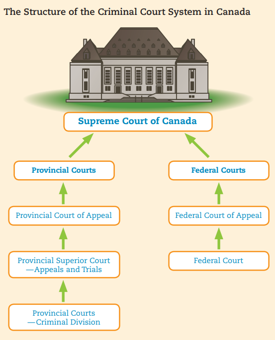
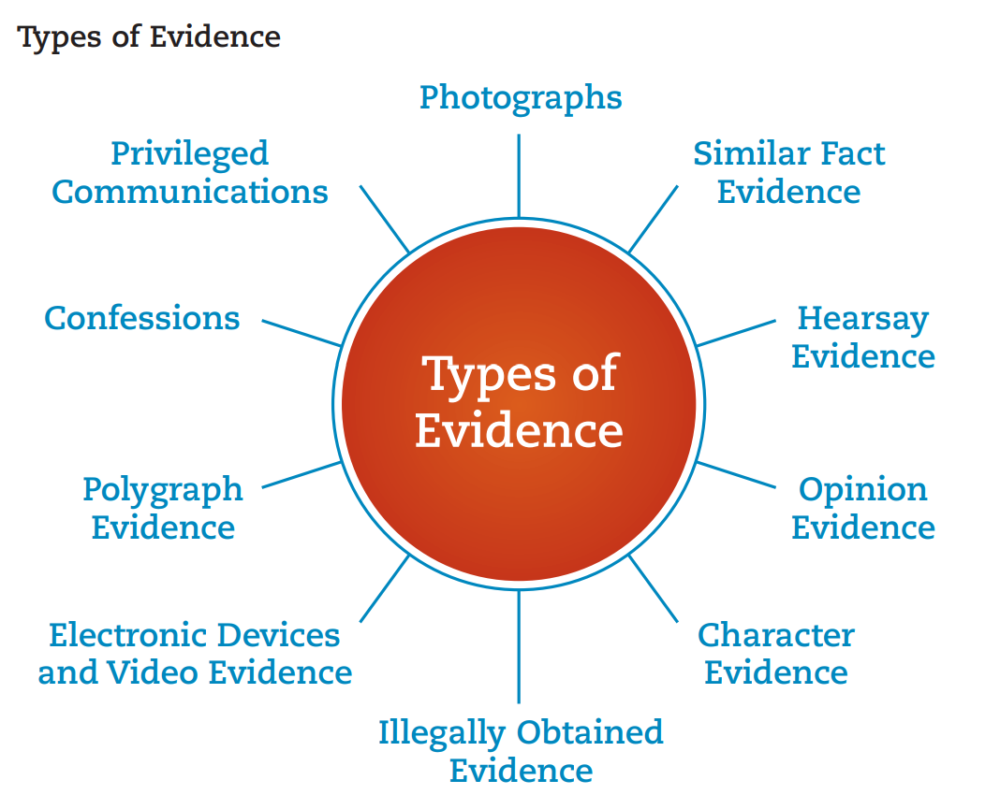

*Use this in combination with other resources*
*Anything in italics are my own comments and should either be taken with a grain of salt or seen as a joke.*
## Chapter 4

### Intro

The criminal code is the main source of criminal law in Canada. It defines what is considered a criminal offence and the punishments for said offences. 

There are 4 conditions that an act must meet in order to be considered a crime.
1. The actions/behaviour of the person must be considered immoral by majority of Canadians.
2. The person's actions must cause harm to society and and individual victims.
3. The harm caused by the person's actions must be serious.
4. The person must be punished by the criminal justice system for their actions.

Any changes to the Criminal Code must take these conditions into consideration. 

### Immoral Behaviors

Morality is subjective and therefore the Criminal Code attempts to reflect what majority of Canadians consider immoral. Canadians have different beliefs on what constitutes immoral behavior. The government can respond by criminalizing, decriminalizing, or legalizing types of behavior.

### Summary Conviction vs Indictable Offences

Offenders will either be charged with summary conviction offences or indictable offences based on the severity of the crime. Summary convictions are less serious. Indictable offences are more serious. Hybrid offenses can be treated as either depending on the prosecutor (crown).

#### Summary Conviction

As mentioned, summary conviction offences are minor criminal offences. While they can still be arrested, the maximum penalties are often a $2000 fine and/or 6 months in jail. There is also a 6 month limitation period wherein after that period, the offender is in the clear. A provincial court judge will hear the evidence and decide the verdict for a summary conviction offence.

#### Indictable Offences

Indictable offences are often serious crimes which as a result, carry more weight in sentencing and penalties. Unlike summary conviction offences, there is no statute of limitations. For serious indictable offences, the accused can choose to be tried by a provincial court judge, a judge of the superiour court of the province/territory, or by a judge of the higher court with a jury.

*Juries are often only available for charges which carry a penalty of over 5 years in prison.*

#### Hybrid Offences

Most offences in the Criminal Code are hybrid offences. This means they can either be charged as indictable or summary conviction charges. The Crown attorney will decide to proceed summarily or proceed by indictment. Until the Crown makes a decision, these charges remain indictable. The Crown will more likely than not base its decision on the previous record of the accused, whether it's beyond the 6 month statute of limitations, and whether lesser penalties are appropriate. The maximum penalties for these crimes can vary from 2-10 years of imprisonment.

### Elements of a Criminal Offence

The 2 main elements of a criminal offence are *actus reus*, the crime which occurred & *mens rea* meaning guilty mind. 

*Essentially did you do it? And if so, did you have criminal intention?*

If the Crown (prosecutors) cannot prove both of these elements beyond the reasonable doubt, the accursed should be acquitted and set free. 

At trial, the Crown will first try to establish the *actus reus* then move to prove *mens rea*. No one can really read the minds of the accused and therefore, judges & juries will decide based on the facts of the case & what the *reasonable person* would believe under the circumstances.

*Example: I'm probably not an avid balloon eating enthusiast with a preference for balloons filled with baking soda if you find 10 balloons filled with cocaine in my stomach.*

#### Mens Rea (Intent/Guilty Mind)

*The guilty mind is the more complex out of the 2 elements. It requires establishing intent without happening to be a mind reader. Essentially, it boils down to whether you had the intention of committing a crime.*

*Example: If I punch a guy in the stomach, it's assault. But if a soccer ball during a game strikes me in the stomach, it's not. This is because there wasn't intent to commit harm.*

##### Criminal State of Mind

While we don't intend for certain outcomes, we may still have a "state of mind." The criminal state of mind means that someone knows what they're doing is illegal even if they didn't intend a specific outcome to happen.

*Example: If I steal something from a store and while fleeing, accidently knock a worker into truck-kun's loving embrace, not only would I be charged with theft, but also manslaughter. This is because I have the criminal state of mind while committing the theft.*

##### Willful Blindness

*Essentially, if you turn a blind eye in order to not be criminally liable but you still know that something criminal is going on, you still have the mens rea.*

*Example: If my Adderall dealer asks me to deliver a package to his good friend Heisenberg and I don't bother looking into the package, I could still be charged with drug trafficking. This is because a normal, sane person would probably wonder why they are delivering packages between 2 known drug dealers or at least would want to know what's in the box.*

##### Recklessness

*You may not have intended to hurt someone but the offence was committed with knowledge and recklessness.*

*Example: If I decide that a bottle of vodka would pair really well with the keys to my car and I end up running over a family of 5, I would have the mens rea as I was being reckless & would be charged with vehicular manslaughter.*

##### Criminal Negligence

*It's like recklessness but you instead you just don't give a shit about the safety of other people.*

*Example: If I decide to sprinkle poison on a cake just for the lols & someone dies because of it, I would be charged with manslaughter as a reasonable person would assume a cake wouldn't be poisoned.*

##### Knowledge

Simply knowing certain facts can provide mens rea.

*Example: I love credit card fraud :))))). If I use a card I know is cancelled, I can be charged with fraud and probably be found guilt as the Crown just needs to prove I used the card and I knew it wasn't good. They wouldn't need to prove I intended to defraud.*

##### Motive

While motive can give us an idea of why the accused may have committed an offence, it doesn't establish guilt. Many of us have motives for potentially actions, but we don't always act on them.

*Let's say I really hate someone (let's call them R). If they find him at the back of the school, dead due to strangulation, just because I might've had a motive, doesn't mean I killed him. The Crown would have to prove I did. ;) The motive can potentially be used as circumstantial evidence. If I was found guilty, the judge could consider my motive during sentencing.*

#### Actus Reus (The Action Itself)

The Crown has to prove you've actually committed a crime.
##### Attempt

A person who tries to commit a crime but fails would still be considered guilty of a criminal offence. It's the attempt that's important.

*Example: I vomit up funny pills wrapped in pp balloons on the plane while trying to smuggle them into Canada, I would still be charged with attempted importation.*

The actus reus starts the moment the first step in committing the crime happens. It's up to judge when the attempt stage happens in the crime. 

*Example: I only attempted the crime once I stepped onto the plane. Everything else was considered as preparation. If they caught me eating the funny flavored pp balloons with the happy pills inside, they could charge me with possession.*

If the Crown cannot prove that the offence was actually committed and only an attempt, then the accused may still be charged with the attempt. If the accused is tried for an attempt and evidence proved the crime was actually committed, the judge may order that the accused should be tried for the offence itself rather than the attempt.

##### Conspiracy

The agreement between 2 or more individuals to commit a crime or achieve something legal via illegal means. 

*Example: Me and my good friend G decide we want to murder a certain individual. We plan it out but don't kill him yet. Despite not committing the murder, we've agreed to a conspiracy to commit the crime.*

It's important to note, jokes and threats are not considered conspiracy.

### Parties to an Offence

#### Aiding or Abetting

If you help someone to commit a crime, you are guilty of aiding that person. If you encourage someone to commit a crime, you are guilty of abetting that person. 

To help is aiding. To urge is abetting.
 
*Example: I really want a brand new Sony A9III but it's $8000 :( If I get my pookie NNCPBOC to help me steal it, he's guilty of aiding me in theft. If I tell him to steal it for me, I'm guilty of abetting him.*

In the Criminal Code, a person who aids or abets a criminal is just as guilty of the crime as the person who commits it.

#### Accessory after the Fact

If you **knowingly** help a criminal escape or hide from law enforcement, you are an accessory after the fact. Providing any form of help is an offence including food, water, or shelter.

*Example: Holy fucking shit, G actually murdered him. If I help hide him from the police by letting him live in my basement, I'm an accessory after the fact.*

#### Organized Crime

A group is considered 3 or more individuals who share a common identity. As soon as a group defines itself by engaging in ongoing criminal activity, it becomes a criminal organization.

*Example: If I start the Kool Kids Klub & we start committing arson, then we're considered a criminal organization.*

### Criminal Court System

The British North America Act, 1867 gave the federal government the power to make criminal law and establish the procedures to be followed in criminal matters. The federal and provincial government split jurisdiction when it comes to the court system.

The provincial government controls the administration of justice.

#### Types of Courts

| Court                      | Jobs                                                                                                                                                                                                                                                                                 | Notes:                                                                                                                                                                            |
| -------------------------- | ------------------------------------------------------------------------------------------------------------------------------------------------------------------------------------------------------------------------------------------------------------------------------------ | --------------------------------------------------------------------------------------------------------------------------------------------------------------------------------- |
| Provincial Courts          | - Reads the charge and enters the plea of the accused  - Holds preliminary hearings for serious indictable offences (when the accused elects to have the case tried in a higher court)  - Hears and tries summary conviction cases and less serious indictable offences. | Judges are appointed by the provincial government.  If a mistake is made in this court, it can be appeal to any higher court.                                               |
| Provincial Superior Courts | - Tries more severe indictable offences  - Hears criminal appeals in summary convictions cases  - Sets provincial precedent                                                                                                                                              | Can be composed of a judge or judge and jury.  Judges are appointed by the federal government.                                                                              |
| Provincial Court of Appeal | - Hears appeals from trials division of the provincial superior courts  - Sets provincial precedent that must be followed by all judges in the province                                                                                                                        | Highest court in the Province.  Only accepts appeals deemed to be of great importance.  Made up of 3-5 judges.  Judges are appointed by the federal government. |
| Federal Courts             | - Hears the legal disputes with the Federal government  - Has jurisdiction involving federal government boards, tribunals, etc.  - Handles appeals to those decisions.                                                                                                   | Divided into the Federal court and Federal Court of Appeals.  Decisions in this court can be appealed to the SC.                                                                                                                      |
| Supreme Court                           | - Hears appeals from the Federal and Provincial Court of Appeals.  - Hears cases of great importance  - Sets national precedence  - Unlimited jurisdiction                                                                                                                                                                                                                                                                                     | Highest court in the land.  Only agrees to hear an appeal if it's of great importance or a question of law needs to be interpreted.  Judges appointed by the federal government and serve until the age of 75.                                                                                                                                                                                  |

## Chapter 5

The police can arrest you during a criminal act or after a police investigation. In either case, you have rights to protect you from the police during arrest and trial procedures (Canadian Charter sections 7-14). 

### Limitations of the Police

The police have limitations so they can't just call in a SWAT raid and massacre a family of 5 (Ready or Not Judge moment). 

#### Searches by Police

The most significant limit is that officers are required to acquire a search warrant to legally conduct a search of a property. In order to do this, they need to present reasonable and probable grounds to a judge. In order to prove police acted on reasonable and probable grounds during a search, they must show they were objective, acted reasonably, and whether there was a clear connection between the search and the criminal offence. If these aren't met and the judge decide evidence was obtained illegally, it's generally considered inadmissible.

#### Arrest

Police cannot arrest a suspect unless they have reasonable and probable grounds that they were involved in a crime. Only when they establish these grounds, they can apprehend and charge a suspect. 

They can do this in 3 ways:

##### Appearance Notice

For summary convictions and less serious indictable offences, if the police believe the accused will not be a threat to others and will attend their bail hearing, they can issue an appearance notice. This notice includes **what they were charged with** and **the time and location of their court appearance**. The officer after issuing an appearance notice will swear the crime has been committed under oath. This is known as swearing an information.

##### Arrest

For serious indictable offences, the police can arrest the suspect and take them into custody. Arrests are made in order to lay charged, preserve evidence and prevent the accused from fleeing or committing further offences. An officer does not need a warrant if there are reasonable grounds to believe an individual committed an offence or is conspiring to.

Canada has an equivalent to Miranda rights known widely in the US. It's called reading caution to the accused (less catchy).

*Example: Let's say the police arrest me for stealing a re-run of the Snow Module Hatsune Miku 1/4 scale figurine. The officer would first identify himself (notice on arrest), advise me that I am under arrest and what I'm being charged with (in this case, theft), stating the first caution which is that I have a right to legal representation (and if I'm a minor, my parents being present as well), stating the second caution which is the right to remain silent and finally touching me physically to signify custody (usually handcuffs).*

If the accused resists arrest, the police have the authority to use as much force as necessary to prevent escape. The trial judge will then decide if police used necessary force or infringed on the accused's right to security of the person. The use of unnecessary force can lead to criminal or civil assault charges against the arresting officer(s).

Officers can use serious or deadly force if the suspect may cause serious harm or death to others, the suspect flees to escape arrest, there are no alternative ways to prevent escape.

##### Warrant for Arrest

If the police have difficulty locating the accused, police can *go cry to a judge or justice of peace* and receive a summons which orders the accused to appear in court at a certain time or place. This document can be delivered by a sheriff or deputy. If the police can prove that the accused will not appear in court, the judge can issue an arrest warrant which names the accused/description of accused, lists their offence(s) and orders the arrest of the accused. If the judge doesn't believe the police provided reasonable grounds, the judge will not issue a summons or warrant.

##### Citizens Arrest

*Side note: Have you ever felt like a vigilante dressed like a certain winged mammal? Want to be a vigilante? You can make a citizen arrest if you witness a criminal act or believe the suspect has committed one. The belief must be reasonable and you cannot beat them. :( You must bring the suspect to the police as soon as possible. You must also state that you are placing the suspect under citizen arrest. Also if you do beat the funny clown man (no copyright infringement intended) into submission or act in an unreasonable way, you can be sued. I guess you can't really be the gritty, depressed and mentally troubled superhero you were born to be... :(*

### Duties of a Police Officer

A functional and bare minimum police service must include these services:
- Crime prevention
- Law enforcement
- Assistance to victims
- Maintaining public order
- Emergency response
- Investigations related to crime

Policing is carried out at three levels: **federal, provincial and municipal.**

*RCMP is federal (the Canadian FBI), OPP is provincial, and Toronto Police Service is municipal.*

RCMP can sometimes serve as provincial police and provincial police forces can work as municipal police.

### Police Conduct & Police Services Act

Police conduct is controlled in 4 main ways:
1. Legislation
2. Judicially (precedents)
3. Administratively (Ontario Civilian Commission on Police Services oversees police conduct in Ontario for instance)
4. Constitutionally (Charter rights section 7 to 10)

Officers may have to act quickly to preserve lives. However, they have to act reasonably or risk their evidence being inadmissible or themselves being sued or charged. Each province has a public board to oversee police operations. Each province also has a provincial police services act to set a legal framework which governs police officers, procedures, penalties, etc.

#### Principles of Canadian Police Services

1. The need to ensure the safety and security of all persons and property
2. The importance of safe guarding the fundamental rights guaranteed by the Charter
3. The need cooperation between police forces and the communities they serve
4. The importance of respecting victims of crimes and their needs
5. The need to be sensitive about the diverse and multicultural character of our society
6. The need to ensure police forces represent the communities they serve.

#### Police Duties

Police are often the first persons at a crime scene and thus a primary duty of theirs is to establish and maintain order. They must also secure crime scenes to avoid evidence tampering. They must also keep an accurate log of what's observed at the crime scene as it may be used in court.

After arresting the accused, an officer's duty is to search the accused for potential evidence related to the charge and items that may assist the accused with escape or posing as a threat. 
##### List of Police Duties

- Preserve the peace
- Prevent crimes
- Assist victims
- Apprehend criminals
- Lay charges
- Participate in prosecutions
- Execute warrants
- Perform other assigned duties
- Enforce law
- Complete training

### Search Law

We as Canadians have the incredibly important right to privacy (section 8 of the Charter protects us from unreasonable search or seizure). The police cannot arbitrarily search you or your property. They cannot record you or seize your property unless they have reasonable and probably grounds.

*An example of reasonable and probable grounds is if the police receive a call about an armed robbery and see me running down the street, body pillow in my arms and a gun in my hand. They can stop me and search me as it's reasonable to believe I committed theft. If I was just chilling near the store, they can't search me as it's unreasonable to think I had any part in the robbery.*

The police must have a search warrant in order to search your person. There are some exceptions. Notably, if you've been arrested or you are reasonably believed to be carrying a concealed weapon.

Other than these exceptions, you don't even need to provide your name or even stand still. As long as you are not arrested or detained, you are free to walk away.

If you are driving a car, they can ask for license, proof of ownership, and insurance papers. They can also stop your car to inspect your vehicle but cannot search your car. They can ask about anything in plain view. However, the item **has to be clearly visible.**

*Example: I'm stopped and the officer spots a duffel bag with unknown contents. They can ask about the bag but I don't need to tell him that it contains lewd Japanese artwork.*

It's important to remember that an officer cannot arrest you unless they catch you in the act of committing a crime or they have reasonable and probable grounds.

#### Our Rights on Being Searched

When someone is arrested for a crime, the police may want to search their places of residence to secure evidence related to the crime. Police can only enter and search your home with a warrant or your permission.

Officers can obtain a search warrant by swearing an information and must have reasonable grounds to believe that a search would yield evidence related to the crime.

The warrant can only be used to execute a search at that specified residence on the specified date. Only specific items specified in the warrant can be seized unless other illegal items are found.

Police when executing a search warrant can demand to enter a property. If entry is denied or the premises are empty, they can break into the property. However, they are still liable for any excessive force used. You may answer the door and ask for a copy of the search warrant. If the document is not correct in any detail (time, location, etc), entry can be denied. Individuals on the premises can only be searched after they've been arrested unless there are reasonable beliefs an individual possesses illegal items or weapons.

Police also require a warrant when using electronic surveillance equipment such as videotapes, trackers, or recording devices which record private conversations. 

There are exceptions such as when police are conducting a search of a place which is not a private residence given there are reasonable and probable grounds that there are illegal drugs present. These searches would take place when there is limited time for a warrant.

### Detainment

Section 9 of the charter protects us from being arbitrarily detained or imprisoned. The police cannot stop you for no reason unless you agree to stop and talk with them *(in that case, you can leave at any time).*

#### Detention

Detention should either lead to arrest within a maximum of a few minutes or the person should be free to go. An officer may ask you if they can ask a few questions. However, you can refuse and the stop should only last as long as it takes to ask that question (you should demand a lawyer and record the officer's badge number if you are stopped for longer). There are exceptions such as spot checks of a vehicle where you need to provide a licence and registration.

#### Arrest

You have the right to a lawyer. Police stations must provide a list of defence lawyers and their phone numbers. If you cannot afford legal representation, you can be provided one via legal aid. You also have the right to remain silent. You should also be told the reason for your arrest right away. All persons have the right to explain their story to the judge. This is called a bail hearing and if your arrest is not legal, you must be released (habeas corpus).

#### Release

After being arrested, a person may be released immediately. This is after they no longer pose a threat and will appear on their trial date. Others will be taken to a police station to have their fingerprints and photographs taken. These accused may also be released. If the accused poses a danger or may commit further crimes, they may be detained until their bail hearing.

Accused will be given a bail hearing within 24 hours. Bail is money or property given to the court to ensure the accused will return at a later date. If an accused does not attend on their court date, their bail is forfeit. If an accused is considered a flight risk or dangerous, bail may be denied.

If you are released, you are required to sign an undertaking and live to the conditions set by the court. You must also sign a recognizance which signifies you acknowledge you are being charged with an offence and you will appear in court on a set date.

If you're not released, you may appeal to a higher court. If you are kept in prison without being arrested, or are denied a bail hearing, an application for a writ of habeas corpus can be made. This would require you appear in court, swear you've been denied these rights and ask for release. If the writ is granted by the judge, you will be released.

## Chapter 6

Trial procedures in Canada are based on the adversarial system which involves the Crown and defence. The burden of proof is on the Crown to prove beyond a reasonable doubt that the accused committed the offence. Mens rea and actus reus need to be established by the Crown for a conviction. 

Provincial courts for summary conviction or minor indictable offences are often less formal and a judge decides the verdict alone as opposed to a jury (which you are only afforded if the penalty is more severe than 5 years of incarceration).

### Roles

*Some stuff was left out. If you need the gist, read this. If you need in depth info, read the chapter.*

Trial procedures are adapted from English law.

#### Judge

Judges (aka the Bench or the Court) are appointed by the government in the case of the Superior, Federal and Supreme Courts. The lieutenant governor of each province will appoint provincial judges and justices of peace. Judges act impartially and without bias. They have full control of the courtroom. 

*For example: one of their more important jobs is to decide whether the BRN-180 assault rifle wrapped in an Asta skin the police seized from the secret bunker under my house is admissible evidence.*

In a trial without a jury, the judge has many other roles such as ruling on credibility of evidence, deciding whether the accused is guilty, and when mandatory minimum sentences are not relevant, sentencing.

#### Crown Attorney

Crown attorneys are hired by the government to represent the Crown and society as a whole as crimes are considered to be acts against society. They are responsible for proving beyond a reasonable doubt that the accused is guilty and seeing that justice is done. They must disclose all available evidence regardless of whether they intend to introduce it or not, even if it weakens their case (principle of disclosure). They have great influence as they consult with police on the case and decide whether to lay criminal charges. They may also withdraw charges laid.

#### Defence Counsel

The defence counsel represents the accused to ensure that the accused’s legal rights are protected and that a proper legal defence is provided.

The accused can represent himself or herself in lower courts, but is encouraged to hire counsel.

They will also advise clients on the law involved in the case and how best to proceed. 

Defence lawyers must represent their clients to the best of their ability, even in cases where the crime is very offensive to the public.

#### Court Clerk & Court Recorder

The court clerk reads out the charge against the accused, swears in witnesses, and handles evidence and much of the paperwork and routine tasks required by the court.

The court recorder sits near the witness box to record, word for word, all evidence given and all questions and comments made during a trial. 

These records are kept and transcripts are made available later, if necessary, for appeals.

#### Sheriff

The sheriff and their deputies carry out a lot of the court admin and trial preparation. It's their job to ensure the accused attends their court date, a jury is selected, and to assist the judge. They also serve summons and carry out court orders.

### Juries

Juries allow us to be judged by our peers who represent the average understanding of the law by the Canadian population rather than a single judge. Juries are expensive and are usually reserved for charges that carry sentences over 5 years. 

The process of selecting the 12 jurors for a criminal trial is known as empanelling. 

Jurors require certain qualifications:
- Canadian citizens
- At least 18 years old
- Resided in the province for at least a year
- Speak either English (yay) or French (boo)
- Mentally fit to take on the responsibility

Some professions are exempted from jury duty due to their specialized knowledge which would defeat the point of a jury.

After being selected, the jurors are sworn in and sit in the jury box. They are then informed of their duties. 

They may not:
- Discuss the case with anyone else other than fellow jurors
- Follow media reports of the case
- Disclose any information from jury discussions not revealed in open court. Even after the conclusion of the trial.

### Evidence

#### Direct Evidence

Direct evidence establishes the existence of a fact on its own.

#### Circumstantial Evidence

Evidence that does not directly prove a fact but instead allows for reasonable inferences to be made based on the evidence available.

#### Witnesses

Before the trial, the Crown provides a list of witnesses (Crown witnesses) to the defence. Both the defence and the Crown can pay witnesses but only if they are expert witnesses who can provide information to help the court. 

Witnesses usually appear voluntarily but may be served a subpoena to order them to appear. If a subpoenaed witness refuses to appear, they may be served with an arrest warrant and detained for 30 days. They can be detained for up to 90 days for contempt of court if a judge finds it fit. 

Once the trial begins, if the judge has not already ordered excluding all witnesses, the defence can asked to have the witnesses who have not yet testified removed from the courtroom to prevent witnesses from changing their testimony. 

Witnesses must take an oath to tell the truth before testifying. A witness who knowingly gives false evidence with the intent to mislead the court would be committing perjury. It's also an offence for the witness to provide contradictory evidence. The maximum penalty is 14 years of imprisonment.

The accused is not required to testify and should not be penalized. (Section 13 of the Charter)

Witnesses will be asked to recall events several times to ensure that they provide consistent answers. Both parties will attempt to discredit each other's witnesses. Judges and the jury will decide on the credibility of a witness.

#### Privileged Communications

Any communications that cannot be presented in court as evidence. Examples include conversations between spouses and conversations between the accused and their lawyer.

#### Similar Fact Evidence

Evidence that shows the accused has committed similar offences in the past. The Crown uses this evidence to imply the accused has reoffended. This evidence can be damaging to an accused's case.

#### Hearsay

Hearsay evidence is something that someone other than the witness has said or written who is not in court. This evidence is generally not admissible.

#### Opinion Evidence

Opinion evidence is what an expert witness thinks about certain facts in a case.

#### Photos 

Photos can be entered as evidence if it can be proven that they are an accurate representation of the crime scene.

#### Electronic Devices and Video Evidence

Evidence obtained through electronic devices or video surveillance will be admitted in court only if Criminal Code procedures have been strictly followed. For instance, it cannot be used to intercept private conversations unless authorized by a court order or one of the parties in the coversation has consented.

#### Confessions

A confession is an accused person’s acknowledgment that the charge, or some essential part of it, is true. Granted the confession is obtained legally, it is admissible in court. Inculpatory confessions are admissions. Exculpatory confessions are denials.

### Verdict

A summation is present by each side. No new evidence can be introduced as it's simply a summary of each side's arguments.

The judge will then make a charge to the jury. This is a review of the facts and explanation of the law applying to the case for the jury. Once the judge has finished the charge, either side can challenge it for legal errors. The jury, however, is excluded from the courtroom while the two sides outline any reasons for such a challenge. When the jurors return, the judge may present a recharge. Many appeals result from the judge’s charge to the jury.

The jury then deliberates and applies the concept of reasonable doubt. They then either deliver a guilty or not-guilty verdict. If the jury cannot reach a unanimous verdict, it will report it to the judge. If the jury cannot reach a decision after further deliberation and the judge is certain more time would not be effective, the jury may be dismissed (hung jury). Juries do not decide sentencing but may recommend one.

If found not guilty, the accused leaves. If found guilty, they will be sentenced.

## Chapter 7

*For the sake of time, it's more effective to read the chapter.*

## Chapter 8

Accused are innocent until proven guilty beyond a reasonable doubt. The accused can respond to the Crown's arguments and present a defense to the charges:

- Dispute actus reus - Deny the committing an offence
- Dispute mens rea - Deny the presence of necessary criminal intent
- Argue they have a valid excuse for what happened when committing the act

### Alibi

The simplest and best defence is an alibi. It proves that the accused was somewhere else when the offence occured.

*Example: If I'm charged with murder but can prove that I was playing HSR in my room alone trying to get stellar jade for Black Swan during the time the crime was committed, the Crown would have to find a way to disprove my alibi.*

This is the only thing the defence is required to disclose to the Crown.

An alibi is often presented upon arrest in a statement to the police. A full alibi defence includes 3 parts:

1. A statement indicating that the accused was not present at the location of the crime
2. An explanation of where the accused was
3. The names of any witnesses to the alibi

These are necessary to raise this defence.

*Back to the example, I would need to have someone confirm I was playing HSR at home at the time. Maybe I was on call with a friend or my mom checked up on me. Perhaps I can show my playtime history.*

While an accused doesn't need to testify, the judge and jury usually expect it when it comes to an alibi.

### Automatism

The automatism defence is interesting as it's developed over time through common law and precedent. Automatism is when an individual has no control over their actions but is still capable of committing an act. 

#### Non-insane

Non-insane automatism is temporary and caused by external factors. This state may be the result of the following:
- Physical blow
- Strokes, sleepwalking, and other physical ailments
- Sleepwalking
- Psychological trauma
- Intoxication

The accused can establish and raise this defence using expert testimony from expert witnesses. The result of a successful defence would be a full acquittal.

#### Insane

Insane automatism is due to a mental ailment. More and more of the mentally ill are finding themselves in the criminal court system. An individual is not criminally responsible for a criminal offence if:
- at the time of the offence, the accused was suffering from a mental disorder
- the mental disorder made the individual incapable of appreciate the nature of the act/knowing what they were doing was wrong

Raising this defence requires the defence to incur the burden of proof. The defence can utilize expert witnesses to prove the defence in court.

If the defence is successful, they are seen as NCR and the judge/provincial review board will decide the sentence based on if the accused will pose a significant threat to public safety. If they do not, they will be released back into society. If so, they will be sent to a psychiatric facility for treatment. The case would then be reviewed annually to determine if the accused is still a significant risk to society.

### Intoxication

To use intoxication as a defence, the accused must show they did not have the required intent at the time the offence was committed. 

A successful use of this defence will knock the specific intent charge down to a general intent charge as all the needs to be proved for general intent charges is that the accused meant to commit the offence and did regardless if they formed the intent to know it was wrong or not.

#### Carter Defence

It's illegal to drive when having a BAC above 80ml of alcohol per 100ml of blood. You can utilize the Carter Defence if you believe the Breathalyzer test administered was inaccurate. It stems from a case where the accused was reported to have a BAC of 200ml/100ml but only consumed 2 beers (under the legal limit). The courts accepted the test was inaccurate and acquitted the accused. This was then changed in July 2008 where you could only use the defence if you could prove the machine did not work properly.

### Battered Woman Syndrome

A defence which gives a reason for committing the offence at the time. This defence stems from a case in which the accused shot her partner in the back of the head. He (victim) had told her (accused) that he would murder her when he returned. The accused believed him and killed him as a result. The victim abused the accused for many years. The jury acquitted the accused, setting a precedent. Before, the danger had to be imminent.  

### Self Defence

You are allowed to defend yourself and your property but only by using necessary and reasonable force. (*You can't just shoot a man who was lunging for you with a knife and then walk up to his crippled body and fire another shot into his head as badass as that might seem.*) To be able to plead self-defence, the accused must feel the threat was real and that the steps to repelled the threat were necessary based on how a reasonable person would react in the same circumstances.

### Necessity

Can be sued to justify a criminal offence due to immediate and urgent circumstances. An example is if you're rushing someone to the hospital and are charged with dangerous driving. You could use this defence as a legal excuse to the charges.

### Duress

The defence of duress is similar to the necessity defence. The circumstances are instead the accused committed the crime under threat of serious harm by other person and thus against thew accused's will. For example, if somone is forced to be a getaway driver at gunpoint. The defence requires the threat be present and immediate at the time the crime was committed. This defence excludes a long list of offenses including murder. It can only be considered when the accused had no other realistic choices.

### Ignorance of the law

Not an accepted defence.

*"OfFiCeR i DiDn'T kNoW kIlLiNg 30 ChIlDrEn AnD mAiMiNg 5 WaS iLlEgAl"*

### Mistake of Fact

If it prevents the accused from having the necessary mens rea, it can be used as a valid defence.

*For example, if I unknowingly get a fake $100 bill and are arrested for using it, I can use the defence of mistake of fact since I didn't know the money was counterfeit.*

### Entrapment

When the police forcefully enourage you to commit a crime. It's a defense as well as an abuse of power by the police. A judge who finds the defence valid should order a stay on proceedings rather than an acquittal.

### Double Jeopardy

To be tried twice for the same offence. This is an infringement of section 11 of the Charter. 

In a case of double jeopardy, a pre-trial motion can be made using one of two pleas: 
1. In a plea of autrefois acquit, the accused states that he or she has already been acquitted of the charge. 
2. In a plea of autrefois convict, the accused states that he or she has already been convicted on the charge. 

The judge will investigate the matter and rule on whether the current charge is based on the same facts as the previous charge that was previously tried. If so, the judge will dismiss the case.

### Provocation

A defence which can reduce a charge of murder to manslaughter. Provocation is a wrongful act/insult so significant it causes an ordinary person to lose self control. 

*An example is if I see my pookie get attacked so I end up murdering the assailant. I could plead provocation.*

The act must be committed in the "heat of passion" and the act must occur immediate after the provocation so there's no cooling off period.

## Chapter 9

*May or may not do this one. Refer to the chapter for this one for now.*